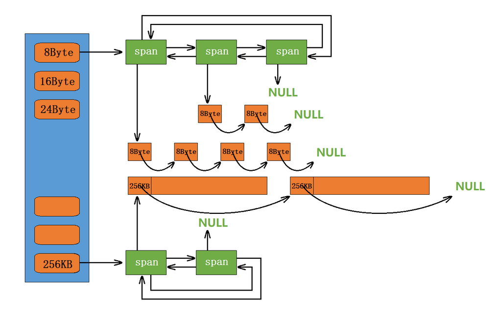
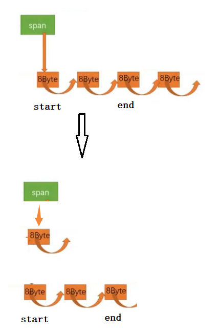

## `CentralCache`

### `CentralCache` 整体框架

当 `ThreadCache` 映射的自由链表为空时它会向 `CentralCache` 申请内存。`CentralCache` 也是一个哈希桶结构，他的哈希桶的映射关系跟 `ThreadCache` 是一样的。不同的是他的每个哈希桶位置挂是 `SpanList` 链表结构，不过每个映射桶下面的 `Span` 中的大内存块被按映射关系切成了一个个小内存块对象挂在 `Span` 的自由链表中。



例如 `8byte` 映射位置下面挂的 `Span` 中的页被切成一个个 `8byte` 大小的对象的自由链表。假设一页有 `8K`，一个小对象的大小是 `8byte`，`8K*1024÷8byte=1024` 块，也就是一页可以被切成 `1024` 块。而页数可以用一个变量 `n_` 来控制。

#### `Span`

`Span` 是一个结构体，该结构体管理以页为单位的大块内存，`Span` 和 `Span` 间用双链表连接起来。`Span` 的内部有自由链表，该自由链表是根据哈希桶映射大小切分好的内存块。`Span` 的内部还记录了内存块的使用等信息。

页号和地址有关，而计算机在不同位下地址长度不同（`32` 位下 `4` 字节，`64` 位下 `8` 字节）。可以用条件编译。

具体结构如下:

```cpp
typedef unsigned long long PAGE_ID;

// 一个 Span 管理多个连续页的大块内存的
struct Span { // 这个结构类似于 ListNode，因为它是构成 SpanList 的单个结点
    PAGE_ID page_id_ = 0; // 大块内存起始页的页号，一个 Span 包含多个页
    size_t n_ = 0; // 页的数量
    size_t use_count_ = 0; // 将切好的小块内存分给 ThreadCache，use_count_ 记录分出去了多少个小块内存
    bool is_used_ = false;
    size_t object_size_ = 0; // 存储当前的 Span 所进行服务的对象的大小
    Span* _next = nullptr; // 双向链表的结构
    Span* _prev = nullptr;
    void* free_list_ = nullptr; // 大块内存切成小块并连接起来，这样当 ThreadCache 要的时候直接给它小块的，回收的时候也方便管理
};
```

#### `SpanList`

不同于 `ThreadCache` 哈希桶上的自由链表 `FreeList`，`CentralCache` 的哈希桶上的自由链表为 `SpanList`，连接 `Span` 的双链表:

```cpp
// 带头的双向循环链表，将每个桶的位置处的多个 Span 连接起来
class SpanList {
public:
    // 构造
    SpanList() {
        head_ = new Span;
        head_->next_ = head_;
        head_->prev_ = head_;
    }
    // 只需要获取到 begin() 和 end()，然后定义一个 Span* 指针就可以完成 SpanList 的遍历
    Span* begin() {
        return head_->next_; // 带头节点
    }
    Span* end() {
        return head_;
    }
    // 插入新页
    void insert(Span* pos, Span* new_span) {
        assert(pos && new_span);
        Span* prev = pos->prev_;
        new_span->next_ = pos;
        new_span->prev_ = prev;
        pos->prev_ = new_span;
        prev->next_ = new_span;
    }
    // 头插
    void push_front(Span* span) {
        insert(begin(), span);
    }
    // 删除
    void erase(Span* pos) {
        assert(head_);
        assert(pos);
        Span* prev = pos->prev_;
        Span* next = pos->next_;
        prev->next_ = next;
        next->prev_ = prev;
    }
    // 头删
    Span* pop_front() {
        Span* front = head_->next_;
        erase(front);
        return front;
    }
    // 判空
    bool empty() {
        return head_->next_ == head_;
    }
    // 上锁
    void lock() {
        mtx_.lock();
    }
    // 解锁
    void unlock() {
        mtx_.unlock();
    }
private:
    Span* head_ = nullptr;
    std::mutex mtx_; // 桶锁: 进到桶里的时候才会加锁
};
```

在 `SpanList`，`Erase pos` 位置的节点时，不 `delete pos`，因为这个节点还要还回 `PageCache` 中。

#### `CentralCache` 的框架

`CentralCache` 要满足 `ThreadCache` 申请的内存。当 `CentralCache` 中没有 `Span` 时需要向下一层 `PageCache` 申请。当有内存还回来时，要能够把它连接到哈希桶对应的 `SpanList` 自由链表上方便下次使用。

```cpp
// 由于全局只能有一个 CentralCache 对象，所以这里设计为单例模式
class CentralCache {
public:
    static CentralCache* get_instance() {
        return &inst_;
    }
    // 获取一个非空的 Span
    Span* get_one_span(SpanList& list, size_t size);
    // 从 CentralCache 获取一定数量的对象给 ThreadCache
    size_t fetch_range_obj(void*& start, void*& end,size_t batch_num, size_t size);
    // 将一定数量的对象释放到 Span
    void release_list_to_spans(void* start, size_t size);
private:
    CentralCache() = default;
    CentralCache(const CentralCache&) = delete;
    CentralCache& operator=(const CentralCache&) = delete;
    static CentralCache inst_;	// 仅声明，定义在 .cpp 里面
    SpanList span_list_[NFREELISTS];
};
```

### `CentralCache` 申请内存

当 `ThreadCache` 中没有内存时，就会批量向 `CentralCache` 申请一些内存对象，这里的批量获取对象的数量使用了类似网络 `TCP` 协议拥塞控制的慢开始算法，`CentralCache` 从 `Span` 中取出对象给 `ThreadCache`，这个过程需要加锁的，这里使用的是一个桶锁，尽可能提高效率。

#### `CentralCache` 从中心缓存获取对象给 `ThreadCache`

从 `CentralCache` 获取 `n` 个指定大小的对象，找到对应的哈希桶，将自由链表 `SpanList` 头删 `n` 个内存块。

这里需要加桶锁，防止多个线程在 `CentralCache` 的自由链表中访问同一内存块，产生线程竞争问题。

```cpp
size_t CentralCache::fetch_range_obj(void*& start, void*& end, size_t batch_num, size_t size) {
    size_t index = SizeClass::index(size);
    span_list_[index].lock(); // 桶锁
    // 在对应哈希桶中获取一个非空的 Span
    Span* span = get_one_span(span_list_[index], size);
    // 获得的页和页中的自由链表不能为空
    assert(span && span->free_list_);
    // 从 Span 中获取 batch_num 个对象，如果不够 batch_num 个，有多少拿多少
    start = span->free_list_;
    end = start;
    size_t actual_num = 1;
    while (--batch_num && next_obj(end) != nullptr) {
        end = next_obj(end);
        ++actual_num;
    }
    span->free_list_ = next_obj(end); // 取完后剩下的对象继续放到自由链表
    next_obj(end) = nullptr; // 取出的一段链表的表尾置空
    span->use_count_ += actual_num; // 更新被分配给 ThreadCache 的计数
    span_list_[index].unlock(); // 解锁
    return actual_num;
}
```

计算出对应 `CentralCache` 中桶的下标，加锁，在对应 `span_list_[index]` 中获取一个非空的 `Span`。假设 `batch_num` 是 `3`，而 `Span` 中有 `4` 个小对象。让 `start` 指向头结点，`end` 往后走 `batch_num-1` 步，再让 `span_list_` 指向 `next_obj(end)`。



但当 `Span` 中个数比 `batch_num` 少时，`end` 不能走到空，否则程序会崩溃，所以当 `next_obj(end)==nullptr` 时，不再继续。

#### `CentralCache` 获取页

```cpp
// 计算一次向系统获取几个页
static inline size_t num_move_page(size_t size) {
    size_t num = num_move_size(size);
    size_t npage = num * size;

    npage >>= PAGE_SHIFT;
    if (npage == 0) {
        npage = 1;
    }
    return npage;
}

// 获取一个非空的 Span
Span* CentralCache::get_one_span(SpanList& list, size_t size) {
    // 查看当前的 SpanList 中是否有还有未分配对象的 Span
    Span* it = list.begin();
    while (it != list.end()) {
        if (it->free_list_) {
            return it;
        } else {
            it = it->next_;
        }
    }
    // 在 fetch_range_obj() 里上的锁，先把 CentralCache 的桶锁解掉，这样如果其他线程释放内存对象回来，不会阻塞
    list.unlock();
    // 走到这里说明没有空闲 Span 了，只能找 PageCache 要
    PageCache::get_instance()->page_lock(); // 这里加锁也可以，如果在 new_span 函数里加锁，需要使用递归锁
    Span* span = PageCache::get_instance()->new_span(SizeClass::num_move_page(size));
    span->object_size_ = size;
    PageCache::get_instance()->page_unlock();
    // 对获取 Span 进行切分，不需要加锁，其他线程访问不到这个 Span
    // 计算 Span 的大块内存的起始地址和大块内存的大小
    // page_id_ 记录起始页的页号，起始地址=页号*每页的大小
    char* start = (char*)(span->page_id_ << PAGE_SHIFT);
    // n_ 记录页的数量，终止地址=页数*每页的大小+起始地址
    size_t bytes = (span->n_ << PAGE_SHIFT);
    char* end = start + bytes;

    // 把大块内存切成小块链接起来
    // 先切一块下来去做头，方便尾插
    span->free_list_ = start;
    start += size;
    void* tail = span->free_list_;
    // 尾插
    while (start < end) {
        next_obj(tail) = start;
        tail = start;
        start += size;
    }
    next_obj(tail) = nullptr;
    // 切好 Span 以后，需要把 Span 挂到桶里面去的时候，再加锁
    list.lock();
    list.push_front(span);
    return span;
}
```

### `CentralCache` 回收内存

当 `ThreadCache` 过长或者线程销毁，则会将内存释放回 `CentralCache` 中的，释放回来时 `--use_count_`。当 `--use_count_` 减到 `0` 时则表示所有对象都回到了 `Span`，则将 `Span` 释放回 `PageCache`，`PageCache` 中会对前后相邻的空闲页进行合并。

```cpp
// 将一定数量的对象释放到 Span
void CentralCache::release_list_to_spans(void* start, size_t size) {
    assert(start);
    size_t index = SizeClass::index(size);
    span_list_[index].lock();
    while (start) {
        void* next = next_obj(start);
        // 通过映射找到对应的 Span
        PageCache::get_instance()->page_lock();
        Span* span = PageCache::get_instance()->map_obj_to_span(start);
        PageCache::get_instance()->page_unlock();
        // 将 start 小块内存头插到 Span 结构的自由链表中
        next_obj(start) = span->free_list_;
        span->free_list_ = start;
        --span->use_count_; // 更新分配给 ThreadCache 的计数
        if (span->use_count_ == 0) {
            span_list_[index].erase(span);
            span->free_list_ = nullptr;
            span->next_ = nullptr;
            span->prev_ = nullptr;

            // 释放 Span 给 PageCache 时，使用 PageCache 的锁就可以了
            span_list_[index].unlock();
            PageCache::get_instance()->page_lock();
            PageCache::get_instance()->releas_span_to_page(span);
            PageCache::get_instance()->page_unlock();
            span_list_[index].lock();
        }
        start = next;
    }
    span_list_[index].unlock();
}
```