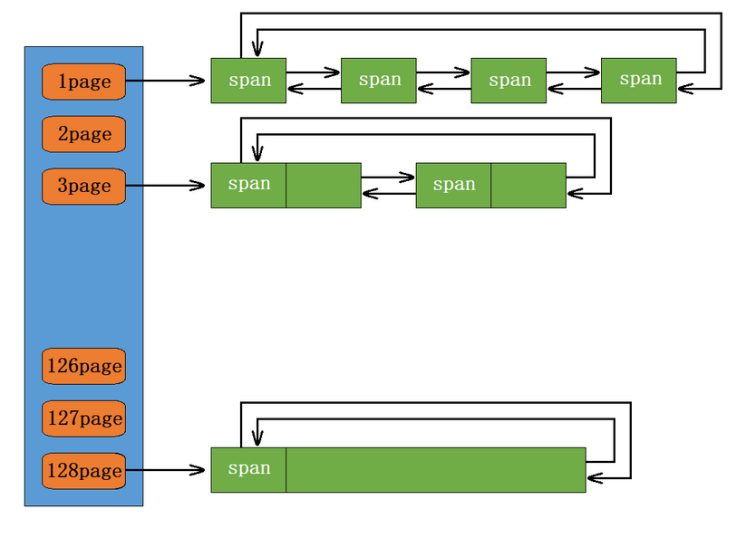

## `PageCache`

### `PageCache` 整体框架

`PageCache` 和 `CentralCache` 它们的核心结构都是 `SpanList` 的哈希桶，但是他们还是有区别的，`CentralCache` 中哈希桶，是按跟 `ThreadCache` 一样的大小对齐关系映射的，他的 `SpanList` 中挂的 `Span` 中的内存都被按映射关系切好链接成小块内存的自由链表。而 `PageCache` 中的 `SpanList` 则是按下标桶号映射的，也就是说第 `i` 号桶中挂的 `Span` 都是 `i` 页内存。



```cpp
class PageCache {
public:
    static PageCache* get_instance() {
        return &inst_;
    }
    // 将 PAGE_ID 映射到 Span* 上，这样可以通过页号直接找到对应的 Span* 的位置
    Span* map_obj_to_span(void* obj);
    // 释放空闲 Span 回到 Pagecache，并合并相邻的 Span
    void releas_span_to_page(Span* span);
    // 向堆申请一个 Span
    Span* new_span(size_t k);
    void page_lock() {
        page_mtx_.lock();
    }
    void page_unlock() {
        page_mtx_.unlock();
    }
private:
    PageCache() = default;
    PageCache(const PageCache&) = delete;
    PageCache& operator=(const PageCache&) = delete;

    static PageCache inst_;
    std::mutex page_mtx_; // 一把大锁，一旦访问 PageCache 就要加锁

    SpanList span_list_[NPAGES];
    ObjectPool<Span> span_pool_;
    // 建立页号和地址间的映射
    std::unordered_map<PAGE_ID, Span*> id_span_map_;
};
```

### `PageCache` 申请内存

当 `CentralCache` 向 `PageCache` 申请内存时，`PageCache` 先检查对应位置有没有 `Span`，如果没有则向更大页寻找一个 `Span`，如果找到则切分成两部分。

比如：申请的是 `4` 页 `page`，`4` 页 `page` 后面没有挂 `Span`，则向后面寻找更大的 `Span`，假设在 `10` 页 `page` 位置找到一个 `Span` ，则将 `10` 页 `pageSpan` 分裂为一个 `4` 页  `pageSpan` 和一个 `6` 页 `pageSpan` ，将 `4` 页的 `pageSpan` 分配出去，将 `6` 页的 `pageSpan` 插入到对应的哈希桶。

如果找到 `SpanList[128]` 都没有合适的 `Span` ，则向系统申请 `128` 页 `pageSpan` 挂在自由链表中，再重复 `1` 中的过程。

#### 建立页号跟 `Span` 的映射

这里我们先建立页号跟 `Span` 的映射关系，方便释放内存对象回来查找对应位置:

```cpp
Span* PageCache::map_obj_to_span(void* obj) {
    // 右移，找到对应的 id
    PAGE_ID id = (PAGE_ID)obj >> PAGE_SHIFT;
    auto ret = id_span_map_.find(id);
    if (ret != id_span_map_.end()) {
        return ret->second;
    } else {
        assert(false);
        return nullptr;
    }
}
```

关于 `page_id_` 和地址的关系，做个简单测试:

```cpp
#include <iostream>

using namespace std;

#define PAGE_SHIFT 12
typedef unsigned long long PAGE_ID;

int main() {
    // 假设有 2 个页
    PAGE_ID id1 = 1, id2 = 2;
    // 查看每个页的起始地址
    char* p1 = (char*)(id1 << PAGE_SHIFT), *p2 = (char*)(id2 << PAGE_SHIFT);
    printf("%p\n", p1); // 0x1000
    printf("%p\n", p2); // 0x2000
    // 两个页相差 4KB
    cout << (p2 - p1) << endl; // 4096

    // 计算某个地址的 id，id 映射页首的地址
    // 在页内偏移，只要在页内，id 也不会变
    for (int i = 0; i != 10000; ++i) {
        int r = rand() % (4 * 1024);
        char* offset_p1 = p1 + r;
        PAGE_ID id = (PAGE_ID)(offset_p1) >> PAGE_SHIFT;
        if (id != id1) {
            cout << "error!\n" << endl;
        }
    }
    return 0;
}
```

系统调用 `mmap` 将一个文件或者其它对象映射进内存。文件被映射到多个页上，如果文件的大小不是所有页的大小之和，最后一个页不被使用的空间将会清零。

当我们通过 `system_alloc`（`Windows` 环境下是 `VirtualAlloc`，`Linux` 下使用 `brk` 或者 `mmap`）直接向系统申请内存时，都是以页为单位的内存，而在 `Linux` 下，一页就是 `4K`。所以从 `0` 开始每一页的起始地址都是 `4K` 的整数倍，那么只需要将申请到的内存地址左移 `12` 位就可以得到相应的页号了，而通过页号也可以计算每一页的起始地址，只需要将地址右移 `12` 位即可。

#### 获取一个 `k` 页的 `Span`

如果第 `k` 个桶中没有，往后找直到第 `n` 个桶中有 `Span`，将这个 `Span` 切分成一个 `k` 页的 `Span` 和一个 `n-k` 页的 `Span`。`k` 页的 `Span` 返回给 `CentralCache`，`n-k` 页的 `Span` 挂到第 `n-k` 桶。

如果没有大块的 `Span`，这时就要去堆申请一个 `128` 页的 `Span`，把这个 `128` 页的 `Span` 插入到对应桶中，再递归调用一次自己。

```cpp
Span* PageCache::new_span(size_t k) {
    assert(k > 0);
    // 如果申请的页大于 128，直接去堆上申请
    if (k > NPAGES - 1) {
        void* ptr = system_alloc(k);
        Span* span = span_pool_.New();
        span->page_id_ = (PAGE_ID)ptr >> PAGE_SHIFT;
        span->n_ = k;
        // 建立页号和 Span* 的映射
        id_span_map_[span->page_id_] = span;
        return span;
    }
    // 先检查第 k 个桶里面有没有 Span
    if (!span_list_[k].empty()) {
        // 第 k 个桶里面有 Span 直接头切一个块
        Span* k_span = span_list_[k].pop_front();
        // 建立 id 和 Span 的映射，方便 CentralCache 回收小块内存时，查找对应的 Span
        for (PAGE_ID i = 0; i < k_span->n_; ++i) {
            id_span_map_[k_span->page_id_ + i] = k_span;
        }
        return k_span;
    }
    // 检查一下后面的桶里面有没有 Span，如果有可以把他它进行切分
    for (size_t i = k + 1; i < NPAGES; i++) {
        if (!span_list_[i].empty()) {
            Span* n_span = span_list_[i].pop_front();
            // new 一个 Span 用于存放其中一个切分好的 Span
            Span* k_span = span_pool_.New();
            // 在 n_span 的头部切一个 k 页下来，k 页 Span 返回
            k_span->page_id_ = n_span->page_id_;
            k_span->n_ = k;
            n_span->page_id_ += k;
            n_span->n_ -= k;
            // n_span 再挂到对应映射的位置
            span_list_[n_span->n_].push_front(n_span);
            // 存储 n_span 的首尾页号跟 n_span 映射，方便 PageCahce 回收内存时进行的合并查找
            id_span_map_[n_span->page_id_] = n_span;
            id_span_map_[n_span->page_id_ + n_span->n_ - 1] = n_span;
            // 建立 id 和 Span 的映射，方便 CentralCache 回收小块内存时，查找对应的 Span
            for (PAGE_ID i = 0; i < k_span->n_; ++i) {
                id_span_map_[k_span->page_id_ + i] = k_span;
            }
            k_span->is_used_ = true;
            return k_span;
        }
        // 走到这个位置就说明后面没有大页的 Span 了
        // 这时就去找堆要一个 128 页的 Span
        Span* big_span = span_pool_.New();
        void* ptr = system_alloc(NPAGES - 1);
        big_span->page_id_ = (PAGE_ID)ptr >> PAGE_SHIFT;
        big_span->n_ = NPAGES - 1;
        span_list_[big_span->n_].push_front(big_span);
        // 调用自己，下次将 128 页进行拆分
        return new_span(k);
    }
}
```

### `PageCache` 回收内存

如果 `CentralCache` 释放回来一个 `Span`，则依次寻找 `Span` 前后 `page_id`，看有没有未在使用的空闲 `Span`，如果有，将其合并。这样就可以将切小的内存合并收缩成大的 `Span`，减少内存碎片。

```cpp
void PageCache::releas_span_to_page(Span* span) {
    // 该 Span 管理的空间是向堆申请的
    if (span->n_ > NPAGES - 1) {
        void* ptr = (void*)(span->page_id_ << PAGE_SHIFT);
        system_free(ptr, span->object_size_);
        span_pool_.Delete(span);
        return;
    }

    // 对 Span 前后的页，尝试进行合并，缓解内存碎片问题
    // 向前合并
    while (1) {
        // 与 Span 链表相连的，上一个 Span 的页号
        PAGE_ID prev_id = span->page_id_ - 1;
        auto ret = id_span_map_.find(prev_id);
        // 前面的页号没有，不合并
        // 前面的 Span 没有被申请过（如果在映射表当中，就证明被申请过）
        if (ret == id_span_map_.end()) {
            break;
        }
        // 前面相邻页的 Span 在使用，不合并
        // 这里不能使用 prev_span 的 use_count 作为判断依据，因为 use_count 的值的变化存在间隙（在切分 Span 时）
        Span* prev_span = ret->second;
        if (prev_span->is_used_ == true) {
            break;
        }
        // 合并出超过 128 页的 Span 没办法管理，不合并
        if (prev_span->n_ + span->n_ > NPAGES - 1) {
            break;
        }

        span->page_id_ = prev_span->page_id_;
        span->n_ += prev_span->n_;

        span_list_[prev_span->n_].erase(prev_span);
        span_pool_.Delete(prev_span);
        prev_span = nullptr;
    }

    // 向后合并
    while (1) {
        PAGE_ID next_id = span->page_id_ + span->n_;
        auto ret = id_span_map_.find(next_id);
        if (ret == id_span_map_.end()) {
            break;
        }
        Span* next_span = ret->second;
        if (next_span->is_used_ == true) {
            break;
        }
        if (next_span->n_ + span->n_ > NPAGES - 1) {
            break;
        }

        span->n_ += next_span->n_;

        span_list_[next_span->n_].erase(next_span);
        span_pool_.Delete(next_span);
        next_span = nullptr;
    }
    // 将和并后的 Span 插入到 PageCache 对应的哈希桶中
    span->is_used_ = false;
    span_list_[span->n_].push_front(span);
    id_span_map_[span->page_id_] = span;
    id_span_map_[span->page_id_ + span->n_ - 1] = span;
}
```