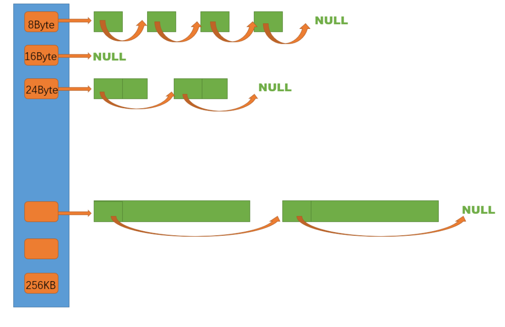

## `ThreadCache`

### `ThreadCache` 整体框架

`ThreadCache` 是哈希桶结构，每个桶是一个按桶位置映射大小的内存块对象的自由链表。每个线程都会有一个 `ThreadCache` 对象，这样每个线程在这里获取对象和释放对象时是无锁的。



当线程要申请内存时，通过计算得到对齐后的字节数，从而找到对应的哈希桶，如果哈希桶中的自由链表不为空，就从自由链表中头删一块内存返回。如果哈希桶中的自由链表为空，就需要向下一层的 `CentralCache` 申请内存。

`ThreadCache` 代码框架如下:

```cpp
class ThreadCache {
public:
    // 申请和释放内存对象
    void* Allocate(size_t size);
    void Deallocate(void* ptr, size_t size);
    // 从中心缓存获取对象
    void* fetch_from_central_cache(size_t index, size_t size);
    // 释放对象时，链表过长时，回收内存到中心缓存
    void list_too_long(FreeList& list, size_t size);
    ~ThreadCache();
private:
    // 哈希桶
    FreeList free_lists_[NFREELISTS];
};

// TLS thread local storage（TLS 线程本地存储）
static __thread ThreadCache* pTLSThreadCache = nullptr;
```

哈希桶中的自由链表是单链表结构，和上文实现的定长内存池一样，通过内存块的前 `4` 位或 `8` 位地址连接下一内存块:

```cpp
// 返回 obj 对象当中用于存储下一个对象的地址的引用
static inline void*& next_obj(void* obj) {
    return *(void**)obj;
}

// 管理切分好的定长对象的自由链表，每个 ThreadCache 里面有很多个 FreeList
class FreeList {
public:
    // 将释放的对象头插到自由链表
    void push(void* obj) {
        assert(obj);
        // 头插
        next_obj(obj) = free_list_;
        free_list_ = obj;
        ++size_;
    }
    // 从自由链表头部获取一个对象
    void* pop() {
        assert(free_list_);
        // 头删
        void* obj = free_list_;
        free_list_ = next_obj(obj);
        --size_;
        return obj;
    }
    // 将释放的 n 个内存块头插入自由链表
    void push_range(void* start, void* end, size_t n) {
        next_obj(end) = free_list_;
        free_list_ = start;
        size_ += n;
    }
    // 从自由链表头部获取 n 个内存块
    void pop_range(void*& start, void*& end, size_t n) {
        assert(n >= size_);
        start = free_list_;
        end = start;
        // 确定获取内存块链表结尾
        for (size_t i = 1; i != n; ++i) {
            end = next_obj(end);
        }
        free_list_ = next_obj(end);
        next_obj(end) = nullptr;
        size_ -= n;
    }
    // 判断自由链表是否为空
    bool empty() {
        return free_list_ == nullptr;
    }
    // 记录当前一次申请内存块的数量
    size_t& max_size() {
        return max_size_;
    }
    // 自由链表中内存块的数量
    size_t size() {
        return size_;
    }
private:
    void* free_list_ = nullptr; // 指向自由链表的指针
    size_t max_size_ = 1; // 一次申请内存块的数量
    size_t size_ = 0; // 记录自由链表中内存块数量
};
```

### `ThreadCache` 哈希桶映射对齐规则

#### 对象大小的对齐映射规则

对象大小的对齐映射并不是均匀的，而是成倍增长的。对象大小的对齐映射固定不变的话，如果映射值较小，就会创建大量的哈希桶，例如 `256kb` 如果按照 `8byte` 划分，则会创建 `32768` 个哈希桶。如果映射值较大，又会造成大量的空间浪费，产生内碎片问题。

为了减少空间浪费率和创建哈希桶的内存开销，我们设计了如下映射关系:

|字节数|对齐数|哈希桶下标|
|-|-|-|
|`[1, 128]`|`8`|`[0, 16)`|
|`[128+1, 1024]`|`16`|`[16, 72)`|
|`[1024+1, 8x1024]`|`128`|`[72, 128)`|
|`[8x1024+1, 64x1024]`|`1024`|`[128, 184)`|
|`[64x1024+1, 256x1024]`|`8x1024`|`[184, 208)`|

例如，字节数为 `5` 字节，向 `8` 字节对齐，分配 `8` 字节，哈希桶下标为 `0`。字节数为 `10000`，向 `1024` 字节对齐，分配 `10x1024=10240` 字节，哈希桶下标为 `138`。

#### 空间浪费率

空间浪费率为浪费的字节数除以对齐后的字节数，以 `129~1024` 这个区间为例，该区域的对齐数是 `16`，那么最大浪费的字节数就是 `15`，而最小对齐后的字节数就是这个区间内的前 `16` 个数（`129~144`）所对齐到的字节数，也就是 `144`，那么该区间的最大浪费率就是 `15÷144≈10.42%`。

#### 计算对象大小的对齐映射数

计算对象大小的对齐映射数时，我们可以先判断该字节属于哪个区间，再调用子函数完成映射:

```cpp
static inline size_t round_up_(size_t bytes, size_t align_num) {
    if (bytes % align_num != 0) {
        return (bytes / align_num + 1) * align_num;
    } else {
        return bytes;
    }
}

// 获取向上对齐后的字节数
static inline size_t round_up(size_t bytes) {
    if (bytes <= 128) {
        return round_up_(bytes, 8);
    } else if (bytes <= 1024) {
        return round_up_(bytes, 16);
    } else if (bytes <= 8 * 1024) {
        return round_up_(bytes, 128);
    } else if (bytes <= 64 * 1024) {
        return round_up_(bytes, 1024);
    } else if (bytes <= 256 * 1024) {
        return round_up_(bytes, 8 * 1024);
    } else {
        assert(false);
        return -1;
    }
}
```

子函数也可以利用位运算，位运算的速度是比乘法和除法更快:

```cpp
static inline size_t round_up_(size_t bytes, size_t align_num) {
    return (((bytes) + align_num-1) & ~(align_num - 1));
}
```

#### 计算内存映射的哈希桶

获取字节对应的哈希桶下标时，也是先判断它在哪个区间，再调用子函数去找。

```cpp
static inline size_t index_(size_t bytes, size_t align_shift) {
    if (bytes % (1 << align_shift) == 0) {
        return bytes / (1 << align_shift) - 1;
    } else {
        return bytes / (1 << align_shift);
    }
}

// 计算映射的哪一个自由链表桶
static inline size_t index(size_t bytes) {
    assert(bytes <= MAX_BYTES);
    // 每个区间有多少个链
    static int group_array[4] = { 16, 56, 56, 56 };
    if (bytes <= 128) {
        return index_(bytes, 3); // 3 是 2^3，这里传的是使用位运算要达到对齐数需要左移的位数
    } else if (bytes <= 1024) {
        return index_(bytes - 128, 4) + group_array[0];
    } else if (bytes <= 8 * 1024) {
        return index_(bytes - 1024, 7) + group_array[0] + group_array[1];
    } else if (bytes <= 64 * 1024) {
        return index_(bytes - 8 * 1024, 10) + group_array[0] + group_array[1] + group_array[2];
    } else if (bytes <= 256 * 1024) {
        return index_(bytes - 64 * 1024, 13) + group_array[0] + group_array[1] + group_array[2] + group_array[3];
    } else {
        assert(false);
        return -1;
    }
}
```

映射哈希桶的子函数也可使用位运算:

```cpp
static inline size_t index_(size_t bytes, size_t align_shift) {
    return ((bytes + (1 << align_shift) - 1) >> align_shift) - 1;
}
```

### `ThreadCache` 申请内存

#### `ThreadCache` 申请内存

- 当申请的内存 `size<=256KB` 时，先获取到线程本地存储的 `ThreadCache` 对象，再通过计算找到 `size` 映射的哈希桶下标 `i`
- 查看下标为 `i` 的哈希桶中的自由链表是否为空，如果哈希桶中的自由链表不为空，就从自由链表中头删一块内存返回
- 如果哈希桶中的自由链表为空，则批量从 `CentralCache` 中获取一定数量的对象，插入到自由链表并返回一个对象

```cpp
void* ThreadCache::Allocate(size_t size) {
    assert(size <= MAX_BYTES);
    size_t align_size = SizeClass::round_up(size);
    // 计算映射的哈希桶下标
    size_t index = SizeClass::index(size);
    if (!free_lists_[index].empty()) {
        return free_lists_[index].pop();
    } else {
        return fetch_from_central_cache(index, align_size);
    }
}
```

#### `ThreadCache` 向 `CentralCache` 获取内存

这里会用到慢开始反馈调节算法，开始不会一次向 `CentralCache` 一次批量要太多，因为要太多了可能用不完，如果不断申请这个 `size` 大小的内存，那么 `batch_num` 就会不断增长，直到上限。

```cpp
// 一次 ThreadCache 应该向 CentralCache 申请的对象的个数（根据对象的大小计算）
static inline size_t num_move_size(size_t size) {
    assert(size > 0);
    // [2, 512]，一次批量移动多少个对象的（慢启动）上限值
    // 小对象一次批量上限高
    // 大对象一次批量上限低
    int num = MAX_BYTES / size;
    if (num < 2) {
        num = 2;
    }
    if (num > 512) {
        num = 512;
    }
    return num;
}
```

比如单个对象大小是 `8` 字节，`MAX_BYTES` 为 `256KB`，除下来的 `num` 太大。如果 `num` 大于 `512` 个，就让其等于 `512`，如果单个对象大小就是 `256KB`，`num=1` 太小，让其等于 `2`，即控制上下限。

```cpp
// ThreadCache 向 CentralCache 获取内存
void* ThreadCache::fetch_from_central_cache(size_t index, size_t size) {
	size_t batch_num = std::min(free_lists_[index].max_size(), SizeClass::num_move_size(size));
    // 慢开始算法
    if (free_lists_[index].max_size() == batch_num) {
        free_lists_[index].max_size() += 1;
    }
    void* start = nullptr;
    void* end = nullptr;
    // 向 CentralCache 申请一段内存
    size_t actual_num = CentralCache::get_instance()->fetch_range_obj(start, end, batch_num, size);
    assert(actual_num > 0);
    if (actual_num == 1) {
        assert(start == end);
        return start;
    } else {
        // 将申请的一段内存头插入对应的自由链表
        free_lists_[index].push_range(next_obj(start), end, actual_num - 1);
        return start;
    }
}
```

刚开始时只给 `1` 个对象（`max_size==1`），如果接下来不断有这个 `size` 大小的内存需求，那么给的批量个数就逐渐增加。当增加到上限值时，就都以上限值为批量数。

但 `CentralCache` 中不一定有足够的对象给 `ThreadCache`，当所拥有的数量小于 `batch_num` 时，有多少就获取多少个。

### `threadcacheTLS` 无锁访问

要实现每个线程无锁的访问属于自己的 `ThreadCache`，我们需要用到线程局部存储 `TLS`，这是一种变量的存储方法，使用该存储方法的变量在它所在的线程是全局可访问的，但是不能被其他线程访问到，这样就保持了数据的线程独立性:

```cpp
static __thread ThreadCache* pTLSThreadCache = nullptr;
```

但不是每个线程被创建时就立马有了属于自己的 `ThreadCache`，而是当该线程调用相关申请内存的接口时才会创建自己的 `ThreadCache`，因此在申请内存的函数中会包含以下逻辑:

```cpp
// 通过 TLS，每个线程无锁的获取自己专属的 ThreadCache 对象
if (pTLSThreadCache == nullptr) {
    pTLSThreadCache = new ThreadCache;
}
```

`TLS` 测试:

```cpp
#include <iostream>
#include <thread>
#include <chrono>

using namespace std;

static __thread int pTLSInt = 0;

const int N = 10;

void worker(int i) {
    this_thread::sleep_for(chrono::seconds(i));
    ++(pTLSInt);
    cout << "thread: " << i << " pTLSInt: " << pTLSInt << endl;
}

int main() {
    thread th[N];
    for (int i = 0; i != N; ++i) {
        th[i] = thread(worker, i);
    }
    for (int i = 0; i != N; ++i) {
        th[i].join();
    }
    return 0;
}
```

每个线程都拥有自己的 `pTLSInt`，对其自增不会影响别的线程。

### `ThreadCache` 释放内存

当释放内存小于 `256k` 时将内存释放回 `ThreadCache`，计算 `size` 映射自由链表桶位置 `i`，将对象 `push` 到对应的 `free_lists_[i]`。

当链表的长度过长，则回收一部分内存对象到 `CentralCache`。

```cpp
void ThreadCache::Deallocate(void* ptr, size_t size) {
    assert(ptr && size <= MAX_BYTES);
    // 找到映射的自由链表桶，将对象插入
    size_t index = SizeClass::index(size);
    free_lists_[index].push(ptr);

    // 当自由链表下面挂着的小块内存的数量大于等于一次批量申请的小块内存的数量时，将 size() 大小的小块内存全部返回给 CentralCache 的 Span 上
    if (free_lists_[index].size() >= free_lists_[index].max_size()) {
        list_too_long(free_lists_[index], size);
    }
}

void ThreadCache::list_too_long(FreeList& list, size_t size) {
    void* start = nullptr;
    void* end = nullptr;
    // 将该段自由链表从哈希桶中切分出来
    list.pop_range(start, end, list.max_size());
    CentralCache::get_instance()->release_list_to_spans(start, size);
}

// 线程结束之前，ThreadCache 当中可能留有一些小块内存，要将这些内存返回给 CentralCache
ThreadCache::~ThreadCache() {
    for (size_t i = 0; i < NFREELISTS; ++i) {
        if (!free_lists_[i].empty()) {
            list_too_long(free_lists_[i], SizeClass::bytes(i));
        }
    }
}
```