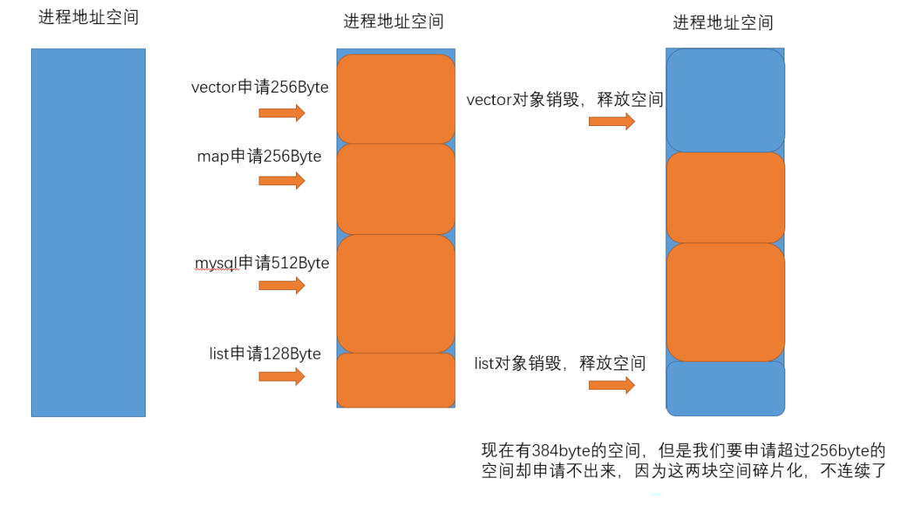

## 什么是内存池

内存池（`Memory Pool`）是一种动态内存分配与管理技术，通常情况下，程序员习惯直接使用 `new`，`delete`，`malloc`，`free` 等 `API` 申请和释放内存，这样导致的后果就是: 当程序运行的时间很长的时候，由于所申请的内存块的大小不定，频繁使用时会造成大量的内存碎片从而降低程序和操作系统的性能。

内存池是指程序预先从操作系统申请一块足够大内存，此后，当程序中需要申请内存的时候，不是直接向操作系统申请，而是直接从内存池中获取。同理，当程序释放内存的时候，并不真正将内存返回给操作系统，而是返回内存池。当程序退出时，内存池才将之前申请的内存真正释放。

## 为什么需要使用内存池

在 `C/C++` 中我们通常使用 `malloc`、`free` 或 `new`、`delete` 来动态分配内存。

一方面，因为这些函数涉及到了系统调用，所以频繁的调用必然会导致程序性能的损耗。

另一方面，频繁的分配和释放小块内存会导致大量的内存碎片的产生，当碎片积累到一定的量之后，将无法分配到连续的内存空间，系统不得不进行碎片整理来满足分配到连续的空间，这样不仅会导致系统性能损耗，而且会导致程序对内存的利用率低下。

内存碎片又分为外碎片和内碎片，上图演示的是外碎片。外部碎片是一些空闲的连续内存区域太小，这些内存空间不连续，以至于合计的内存足够，但是不能满足一些的内存分配申请需求。内部碎片是由于一些对齐的需求，导致分配出去的空间中一些内存无法被利用。

`C/C++` 中动态申请内存并不是直接去堆上申请的，而是通过 `malloc` 函数去申请的，`C++` 中的 `new` 本质上也是封装了 `malloc` 函数。

`malloc` 就是一个内存池。`malloc()` 相当于向操作系统 `批发` 了一块较大的内存空间，然后 `零售` 给程序用。当全部 `售完` 或程序有大量的内存需求时，再根据实际需求向操作系统 `进货`。

`malloc` 的实现方式有很多种，一般不同编译器平台用的都是不同的。