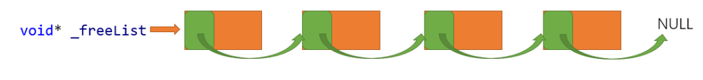
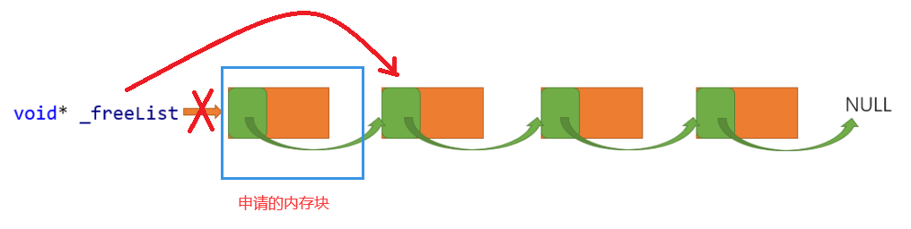
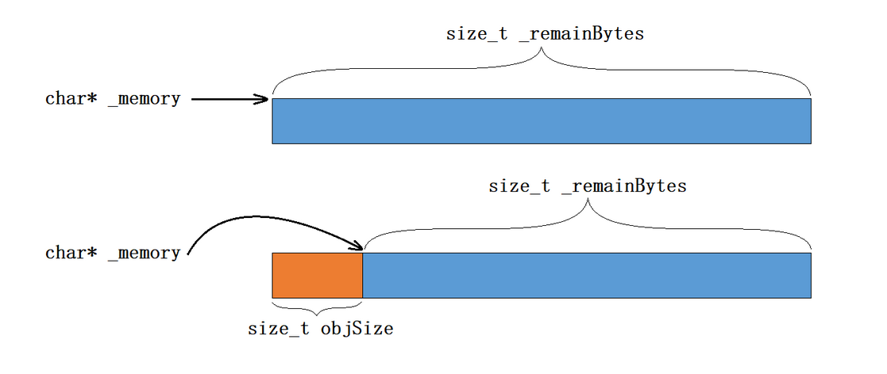
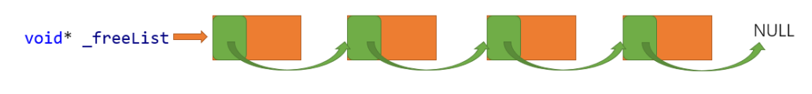
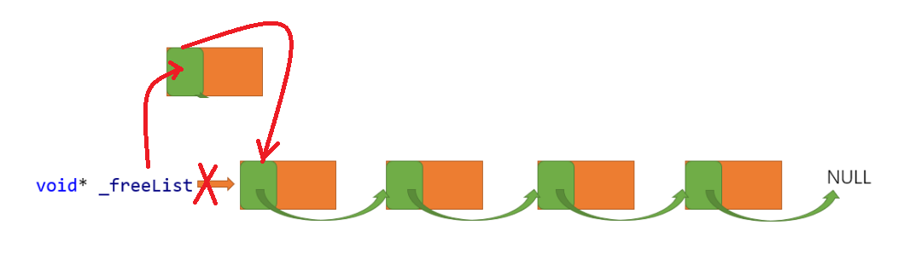

## 定长内存分配器

定长内存池是针对固定大小内存块的申请和释放的问题，因为它申请和释放的内存块大小是固定的，所以不需要考虑内存碎片化的问题。

### 如何实现定长

我们可以利用非类型模板参数来控制向该内存池申请的内存大小，如下面代码，可以控制每次向内存池申请的内存大小为 `N`:

```cpp
template<size_t N>
class ObjectPool { };
```

此外，定长内存池也叫做对象池，在创建对象池时，对象池可以根据传入的对象类型的大小来实现定长，我们可以通过模板参数来实现定长，例如创建定长内存池时传入的对象类型是 `int`，那么该内存池就只支持 `4` 字节大小内存的申请和释放:

```cpp
template<class T>
class ObjectPool { };
```

### 定长内存池向堆申请空间

这里申请空间不用 `malloc`，而是用 `malloc` 的底层，直接向系统要内存，在 `Windows` 下，可以调用 `VirtualAlloc` 函数，在 `Linux` 下，可以调用 `brk` 或 `mmap` 函数:

```cpp
#include <sys/mman.h>
#include <fcntl.h>
#include <unistd.h>
inline static void* system_alloc(size_t kpage) {
    errno;
    // 该内存可读可写（PROT_READ | PROT_WRITE）
    // 私有映射，所做的修改不会反映到物理设备（MAP_PRIVATE）
    // 匿名映射，映射区不与任何文件关联，内存区域的内容会被初始化为 0（MAP_ANONYMOUS）
    int fd = open("/dev/zero", O_RDWR);
    void* ptr = mmap(0, (kpage << 12), PROT_READ|PROT_WRITE, MAP_PRIVATE|MAP_ANONYMOUS, fd, 0);
    // 成功执行时，mmap() 返回被映射区的指针
    // 失败时，mmap() 返回 MAP_FAILED [其值为(void *)-1]，
    // errno 被设为某个值
    close(fd);
    if (ptr == MAP_FAILED) {
        std::cerr << "MAP_FAILED!" << std::endl;
        std::cerr << "errno: " << strerror(errno) << std::endl;
        throw std::bad_alloc();
    }
    return ptr;
}
```

### 定长内存池中的成员变量

对于申请的大块内存，我们可以利用指针进行管理，再用一个变量来记录申请的内存中剩余的内存大小。


对于释放回来的内存，我们可以利用链表来管理，这就需要一个指向链表的指针。



所以定长内存池中设计了三个变量:
- 指向大块内存的指针
- 记录大块内存在切分过程中剩余字节数的变量
- 记录回收内存自由链表的头指针

```cpp
template<class T>
class ObjectPool {
public:
    T* New();
    void Delete(T* obj);

private:
    char* memory_ = nullptr; // 指向大块内存的指针
    size_t remain_bytes_ = 0; // 大块内存在切分过程中剩余字节数
    void* free_list_ = nullptr; // 还回来过程中链接的自由链表的头指针
};
```

### 定长内存池为用户申请空间

当我们为用户申请空间时，优先使用释放回来的内存，即自由链表。将自由链表头节点删除并将该内存返回。



如果自由链表当中没有内存块，那么我们就在大块内存中切出定长的内存块进行返回。内存块切出后，及时更新 `_memory` 指针的指向，以及 `remain_bytes_` 的值。



当大块内存不够切分出一个对象时，调用封装的 `system_alloc` 函数向系统申请一大块内存，再进行切分。

为了让释放的内存能够并入自由链表中，我们必须保证切分出来的对象能够存下一个地址，即申请的内存块至少为 `4` 字节（`32`位）或 `8` 字节（`64` 位）:

```cpp
T* New() {
    T* obj = nullptr;
    // 优先把还回来内存块对象，再次重复利用
    if (free_list_) {
        // 从自由链表头删一个对象
        void* next = *((void**)_freeList);
        obj = (T*)free_list_;
        free_list_ = next;
    } else {
        // 剩余内存不够一个对象大小时，则重新开大块空间
        if (remain_bytes_ < sizeof(T)) {
            remain_bytes_ = 128 * 1024;
            memory_ = (char*)system_alloc(remain_bytes_ >> 13);
            // 申请内存失败抛异常
            if (memory_ == nullptr) {
                throw std::bad_alloc();
            }
        }
        // 从大块内存中切出 obj_size 字节的内存
        obj = (T*)memory_;
        // 保证对象能够存下一个地址
        size_t obj_size = sizeof(T) < sizeof(void*) ? sizeof(void*) : sizeof(T);
        // 调整成员变量
        memory_ += obj_size;
        remain_bytes_ -= obj_size;
    }
    // 定位 new，显示调用 T 的构造函数初始化
    new(obj)T;
    return obj;
}
```

注意:

`void* next = *((void**)_freeList);`

`_freeList` 本来是一个一维指针，指向自由链表的起始地址，其指向的内容就是下一块内存的地址（嵌入式指针），先将其强制转换为二维指针，经过强制转换后的 `_freeList` 指针本身指向的地址是没有变化的，即 `(void**)_freeList` 也指向 `_freeList` 的所指向的地址，并且这个地址内存放的是指针，再将其解引用，得到的是一个地址，该地址就是下一块内存的地址。换句话说，`next` 应该等于 `_freeList` 指向的内存，该内存存储的是下一块内存的地址，这样，`next` 就指向了下一块内存。

测试:

```cpp
#include <iostream>

using namespace std;

struct Test {
    struct Test* next;
};

int main() {
    cout << "sizeof(Test) = " << sizeof(Test) << endl;
    // t（指针）->t1（对象）->t2（对象）->t3（对象）
    Test t1, t2, t3, *t = &t1;;
    t1.next = &t2;
    t2.next = &t3;
    t3.next = nullptr;
    cout << "t addr = " << t << endl
         << "t1 addr = " << &t1 << endl
         << "t2 addr = " << &t2 << endl
         << "t3 addr = " << &t3 << endl;

    Test* next = *((Test**)t);
    cout << "next addr == t2 addr: " << (next == &t2 ? "true" : "false") << endl;
    return 0;
}
```

`size_t objSize = sizeof(T) < sizeof(void*) ? sizeof(void*) : sizeof(T);`

如果需要分配的对象内存不足一个指针的大小，则分配一个指针的大小。

### 定长内存池管理回收的内存

我们用链表管理回收的内存，为了方便使用和节省空间，我们用内存块的前 `4` 个字节（`32` 位）或 `8` 个字节（64 位）记录下一个内存块的起始地址，如下图所示。



当回收内存块时，将内存块头插入自由链表即可。



```cpp
void Delete(T* obj) {
    // 显示调用析构函数清理对象
    obj->~T();
    // 头插
    *(void**)obj = free_list_;
    free_list_ = obj;
}
```

如何让一个指针在 `32` 位平台下解引用后能向后访问 `4` 个字节，在 `64` 位平台下解引用后能向后访问 `8` 个字节呢？

这里我们利用二级指针，因为二级指针存储的是一级指针的地址，而一级指针会在不同的平台下呈现出不同的大小，二级指针解引用会向后访问一级指针的大小。将其写成函数:

```cpp
static void*& next_obj(void* obj) {
    return *(void**)obj;
}
```

### 定长内存池代码

`ObjectPool` 类:

[ObjectPool](../ObjectPool/ObjectPool.h)

`ObjectPool` 测试:

[TestObjectPool](../ObjectPool/TestObjectPool.cpp)

测试结果:

```
sizeof(std::string*) = 8
new cost time:2168
object pool cost time:1515
```

从结果中我们可以看出，设计的定长内存池要比 `malloc` 和 `free` 快一些。但是定长内存池只适用于申请和释放固定大小的内存，而 `malloc` 和 `free` 可以申请和释放任意大小的内存。

为了解决定长内存池的局限性，谷歌设计了 `tcmalloc`，下面模拟实现 `tcmalloc` 简易版本。