## 申请内存与释放内存

### 申请内存接口

每个线程都有自己的 `TLS`，不可能让用户自己去调用 `TLS` 然后才能调到 `Allocate`，而是应该直接给他们提供接口:

```cpp
static ObjectPool<ThreadCache> tcPool;

// 

static void* ConcurrentAllocate(size_t size) {
    // 当对象大小 > 256KB 时，放到 new_span 里面处理
    if (size > MAX_BYTES) {
        size_t align_size = SizeClass::round_up(size);
        PageCache::get_instance()->page_lock();
        Span* span = PageCache::get_instance()->new_span(align_size >> PAGE_SHIFT);
        PageCache::get_instance()->page_unlock();
        void* ptr = (void*)(span->page_id_ << PAGE_SHIFT);
        return ptr;
    } else {
        if (pTLSThreadCache == nullptr) {
            pTLSThreadCache = tcPool.New();
        }
        return pTLSThreadCache->Allocate(size);
    }
}
```

### 释放内存接口

向外提供一个 `concurrent_free` 函数，用于释放内存块，释放内存块时每个线程通过自己的 `ThreadCache` 对象，调用 `ThreadCache` 中释放内存对象的接口:

```cpp
static void concurrent_free(void* ptr) {
    // 别人可能正在对 id_span_map 进行写入操作，应该等别人写完再读（写入操作只在 new_span 函数中, 而调用 new_span 函数前都会加锁)
    PageCache::get_instance()->page_lock();
    Span* span = PageCache::get_instance()->map_obj_to_span(ptr);
    PageCache::get_instance()->page_unlock();
    size_t size = span->object_size_;
    if (size > MAX_BYTES) { // 大于 NAPES - 1 的情况放到 PageCache 里面处理
        PageCache::get_instance()->page_lock();
        PageCache::get_instance()->releas_span_to_page(span);
        PageCache::get_instance()->page_unlock();
    } else {
        assert(pTLSThreadCache);
        pTLSThreadCache->Deallocate(ptr, size);
    }
}
```

### 申请内存流程

申请一部分内存，通过调试查看申请流程:

```cpp
void* p1 = concurrent_allocate(6);
void* p2 = concurrent_allocate(8);
void* p3 = concurrent_allocate(1);
```

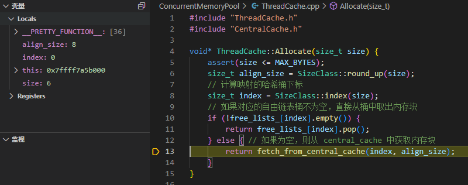

当线程第一次申请内存时，该线程需要通过 `TLS` 获取到自己专属的 `ThreadCache` 对象，然后通过这个 `CentralCache` 对象进行内存申请。

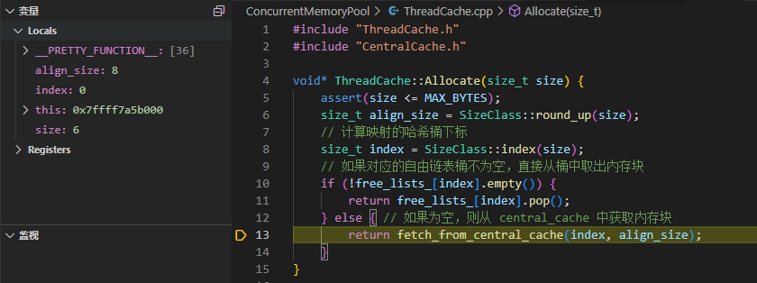

当我们申请 `6` 个字节的内存时，`6` 字节会被映射成 `8` 字节，对应的哈希桶下标为 `0`。我们去 `ThreadCache` 的哈希桶申请内存时，如果该哈希桶中自由链表为空，就要向下一层 `CentralCache` 申请内存块。

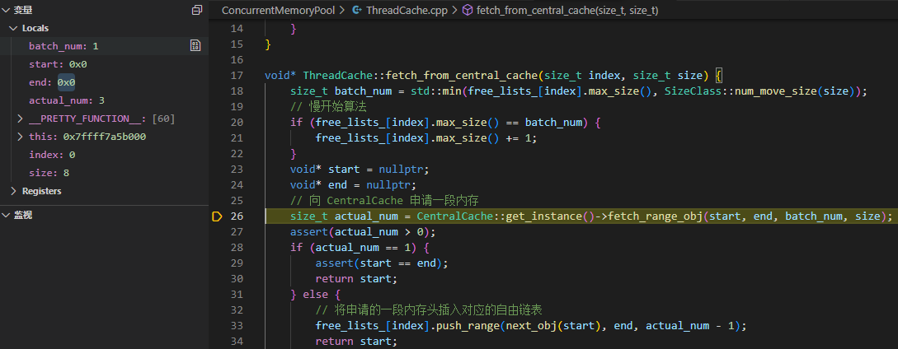

通过 `num_move_size` 函数计算得出，`ThreadCache` 一次向 `CentralCache` 申请 `8` 字节大小对象的个数是 `512`，申请的内存块太多了，我们使用慢开始算法。取出自由链表的 `max_size_` 的值和 `num_move_size` 函数计算得出值的较小值。`max_size_` 的初始值为 `1`，所以向 `CentralCache` 申请 `1` 个 `8` 字节内存块。完成后再将 `max_size_` 的加 `1`，让下一次申请更多的内存块。

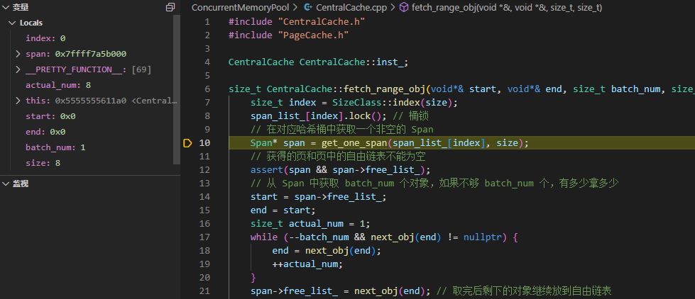

向 `CentralCache` 申请内存时需要给桶加锁，避免在自由链表中产生竞争。然后再从该桶获取一个非空的 `Span`。

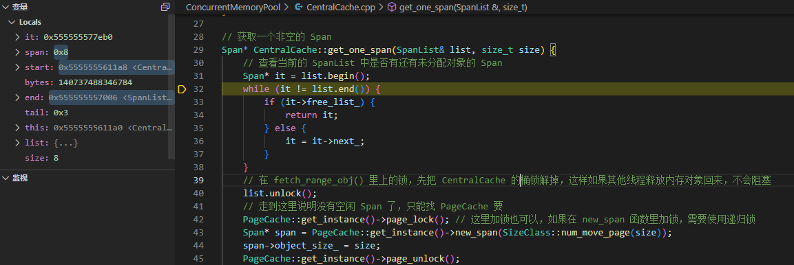

遍历对应哈希桶的 `Span` 双链表，如果存在不为空的 `Span` 就将该 `Span` 返回，否则就向下一层 `PageCache` 申请。注意这里需要将先前加在 `CentralCache` 上的锁释放掉，而且向 `PageCache` 申请内存需要加一个大锁。

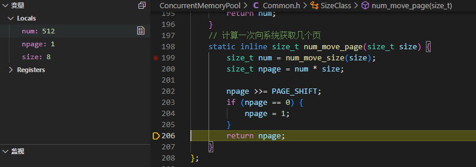

申请的对象的数量为 `512`，每个对象需要 `8` 字节，一共需要 `4096` 字节，也就是 `4KB`，分配 `1` 页即可。

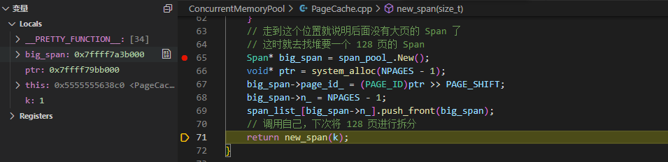

此时 `PageCache` 没有 `Span`，它要去堆上申请 `128` 页的 `Span`，在递归调用该函数。

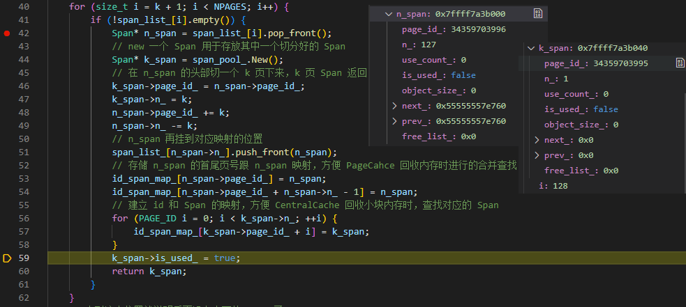

将 `128` 页的 `Span` 拆分成 `1` 页和 `127` 页的 `Span`，返回 `1` 页的 `Span` 给 `CentralCache`，把 `127` 页的 `Span` 挂到 `PageCache` 的第 `127` 号桶上。

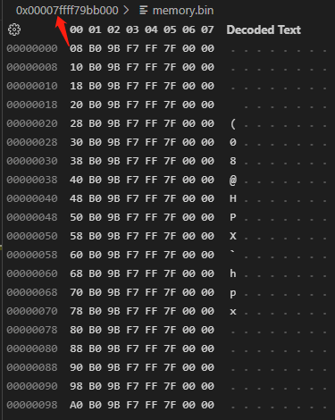

从 `PageCache` 返回后，将获取到的 `1` 页 `Span` 切分一个个 `8` 字节的内存块挂到 `CentralCache` 的 `0` 号哈希桶上。前 `8` 个字节指向下一个内存块的地址。

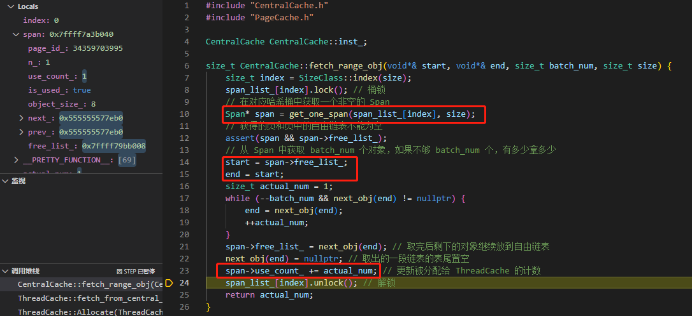

`CentralCache` 再分配给 `ThreadCache` 所需求的内存块。

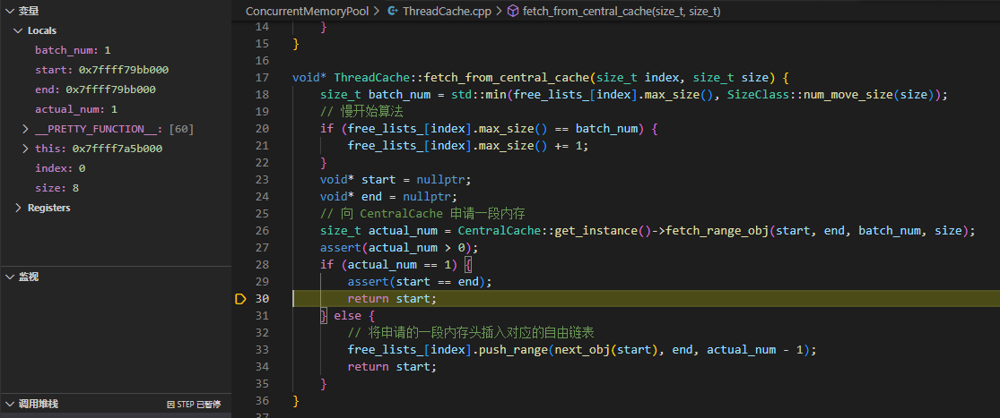

此时 `ThreadCache` 已经申请到了内存块，完成了一次申请内存。

当线程第二次申请内存块时就不会再创建 `ThreadCache` 了，因为第一次申请时就已经创建好了，此时该线程直接获取到对应的 `ThreadCache` 进行内存块申请即可。

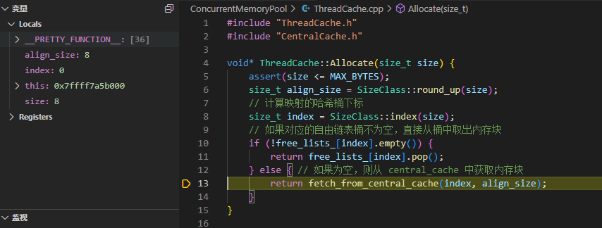

第二次申请 `8` 字节大小的对象时，此时 `ThreadCache` 的 `0` 号桶中还是没有对象的，因为第一次 `ThreadCache` 只向 `CentralCache` 申请了一个 `8` 字节对象，因此这次申请时还需要再向 `CentralCache` 申请对象。

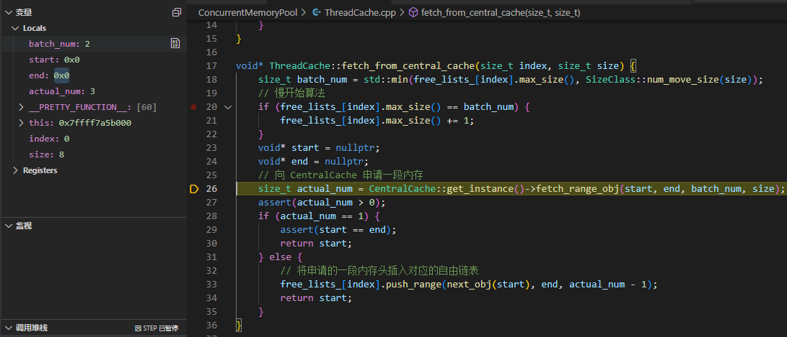

因为慢增长算法，这一次 `ThreadCache` 会向 `CentralCache` 申请 `2` 个 `8` 字节大小的内存块。

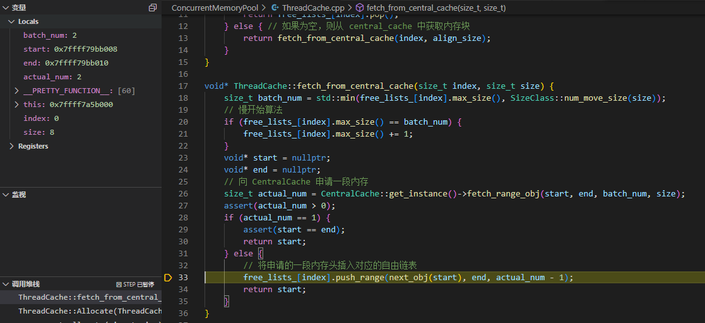

因为第一次 `CentralCache` 向 `PageCache` 申请了一页的内存块，并将其切成了 `512` 个 `8` 字节大小的内存块，所以此次 `ThreadCache` 会向 `CentralCache` 申请 `2` 个 `8` 字节大小的内存块时，`CentralCache` 可以从 `0` 号哈希桶中直接返回，而不用再向 `PageCache` 申请内存了。

申请了两个 `8` 字节内存块，但只使用了一个，我们需要将剩下的一个内存块挂入哈希桶中。

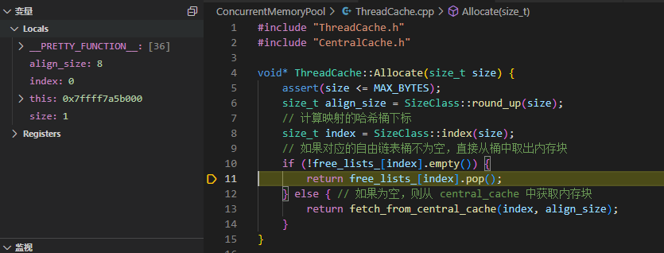

第三次申请 `8` 字节内存时，直接向 `ThreadCache` 获取第二次申请剩下的内存块即可。

### 内存释放流程

现在我们释放先前申请的三个内存块，通过调试，看看流程是什么样的:

```cpp
concurrent_free(p1);
concurrent_free(p2);
concurrent_free(p3);
```

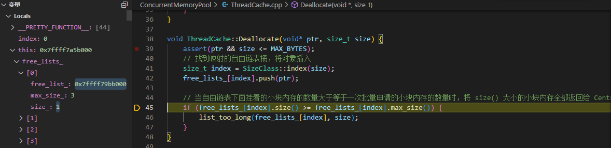

我们释放第一个对象后，对应的自由链表中的内存块只有一个，并不会将该自由链表当中的对象进一步还给 `CentralCache`。

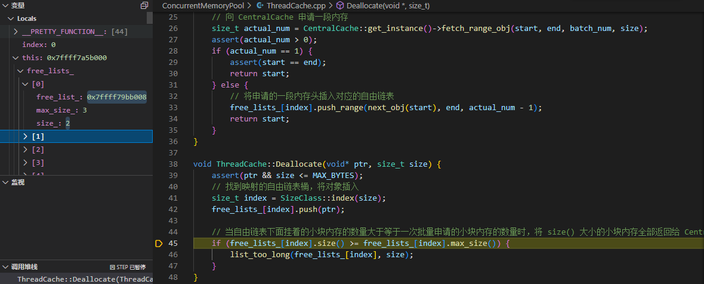

释放第二个对象和第一个对象情况类似，并不满足将内存块还给 `CentralCache` 的条件。

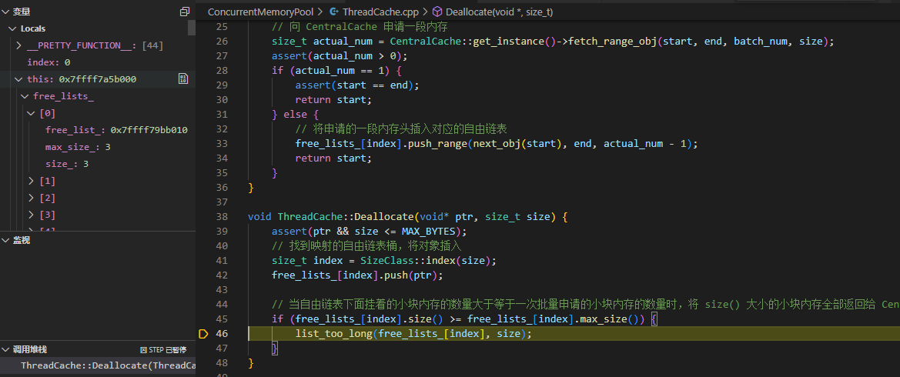

释放第三个对象时，就需要将内存块还给 `CentralCache` 了。

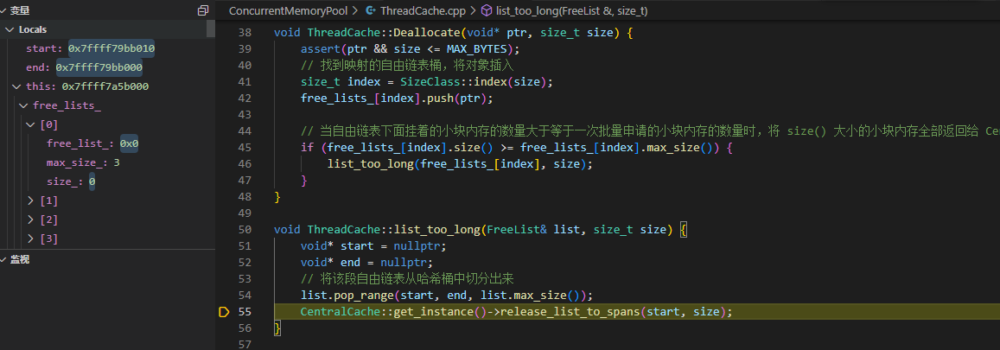

将内存块还给 `CentralCache` 首先要将内存块的自由链表切分出来。切分后 `free_list_[0].size_=0`，该自由链表为空。

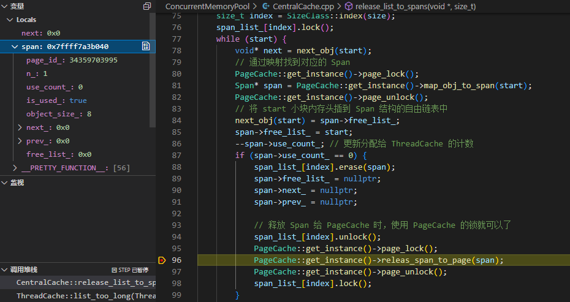

通过映射找到内存块对应的 `Span`，循环将内存块链表依次头插入 `Span` 结构的自由链表中。当 `Span` 的切分出去的所有小块内存都还回来时，这个 `Span` 就可以再回收给 `PageCache`。

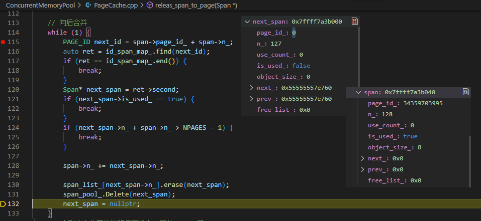

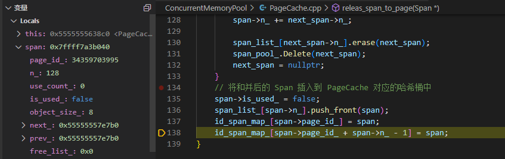

因为申请内存时将 `128` 页 `Span` 分成了 `1` 页 `Span` 和 `127` 页 `Span`，所以 `CentralCache` 释放合成的 `1` 页 `Span` 应该向后合并。这里重新将 `1` 页 `Span` 和 `127` 页 `Span` 合并成 `128` 页 `Span`，并将这 `128` 页的 `Span` 插入到 `PageCache` 对应的哈希桶（`128` 号桶）中。之后再建立该 `Span` 与其首尾页的映射，完成释放流程。