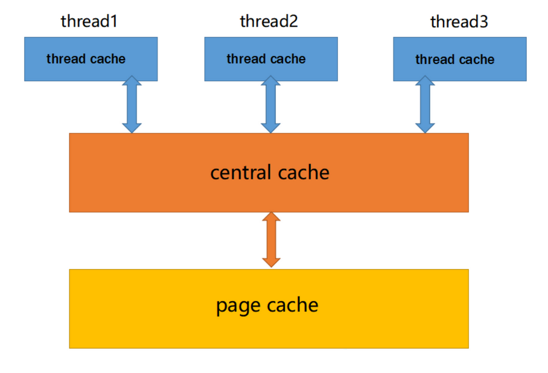

## 高并发内存池整体框架设计

在多线程申请内存的场景下，必然存在激烈的锁竞争问题。我们实现的内存池需要考虑以下几方面的问题:
- 性能问题
- 多线程环境下，锁竞争问题
- 内存碎片问题

`concurrent memory pool` 主要由以下 `3` 个部分构成：
- `ThreadCache`: 线程缓存是每个线程独有的，用于小于 `256KB` 的内存的分配，线程从这里申请内存不需要加锁，每个线程独享一个 `cache`，这也就是这个并发线程池高效的地方
- `CentralCache`: 中心缓存是所有线程所共享，`ThreadCache` 是按需从 `CentralCache` 中获取的对象。`CentralCache` 合适的时机回收 `ThreadCache` 中的对象，避免一个线程占用了太多的内存，而其他线程的内存吃紧，达到内存分配在多个线程中更均衡的按需调度的目的。`CentralCache` 是存在竞争的，所以从这里取内存对象是需要加锁，首先这里用的是桶锁，其次只有 `ThreadCache` 没有内存对象时才会找 `CentralCache`，所以这里竞争不会很激烈
- `PageCache`: 页缓存是在 `CentralCache` 缓存上面的一层缓存，存储的内存是以页为单位存储及分配的，`CentralCache` 没有内存对象时，从 `PageCache` 分配出一定数量的 `page`，并切割成定长大小的小块内存，分配给 `CentralCache`。当一个 `Span` 的几个跨度页的对象都回收以后，`PageCache` 会回收 `CentralCache` 满足条件的 `Span` 对象，并且合并相邻的页，组成更大的页，缓解内存碎片的问题

