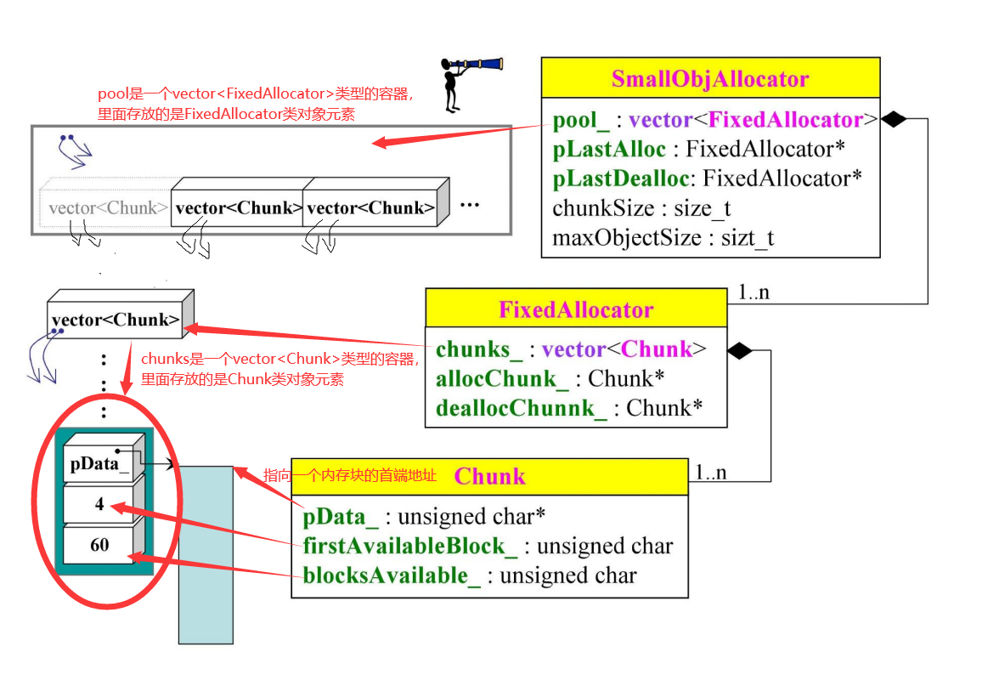
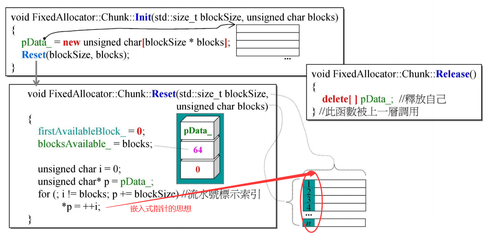
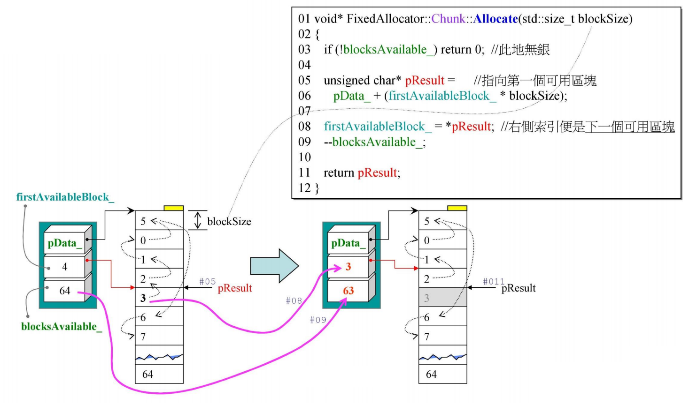
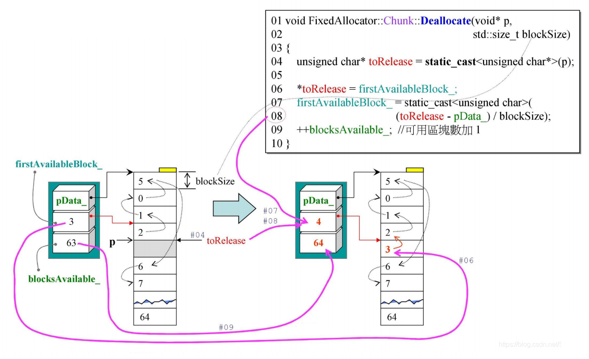
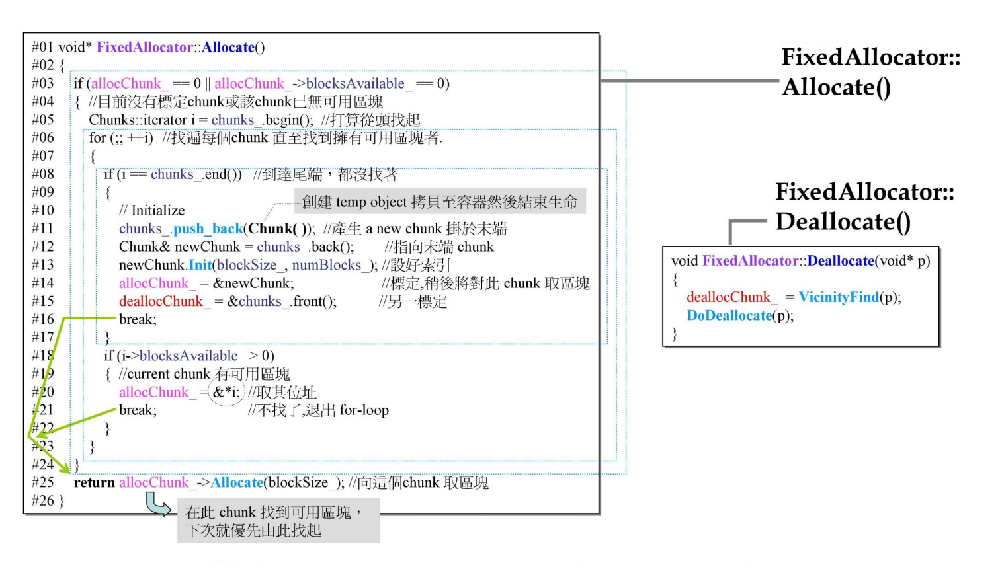
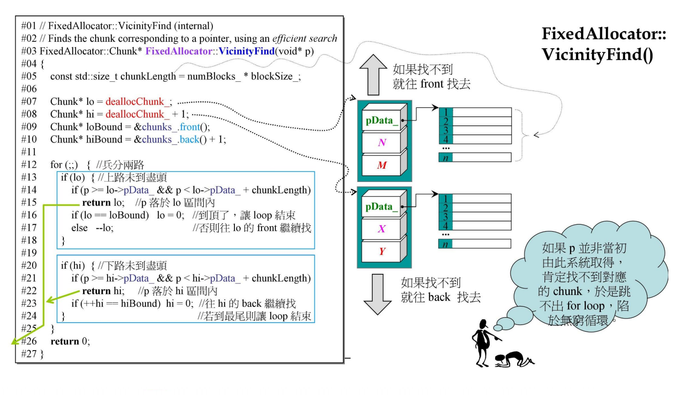
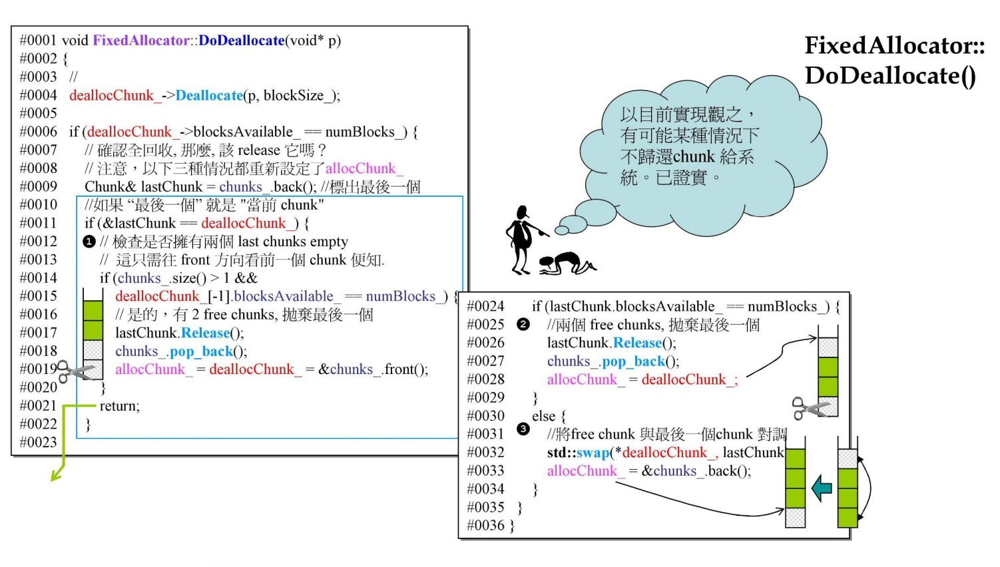

# `loki::allocator`

> 成竹在胸

`Loki Library` 是一个在业界很前沿的库，但是不成熟，作者对这个库的维护只到 `0.1.7` 版本

`GNU C` 的编译器不会将内存归还给 `OS`，在多进程的时候会有影响。但是 `loki` 会将内存进行归还

- 三个 `class`，从下往上就是从底层到上层

## `loki allocator` 行为图解

### `Chunk`

#### `Chunk::Init` && `Chunk::Reset`

- `Init()` 函数初始化时，先 `new` 出一块数组内存空间，然后返回该内存空间首地址给 `pData_`
- 接着进入 `Reset()` 函数，对这块内存进行分割，利用嵌入式指针的思想，每一块 `block` 的第一个 `byte` 存放的是下一个 `block` 距离起始位置 `pData_` 的偏移量（以 `blockSize` 大小为单位），以这种形式将 `blocks` 串成 `链表`:
  - `*p = ++i` 表示在当前 `block` 的第一个 `byte` 放置指示距 `pData_` 的指针偏移量
  - `p += blockSize` 表示移动到下一个临近的 `block` 上

#### `Chunk::Allocate()`

- 将距离 `Chunk` 中距离 `p_Data_` 偏移量为 `4` 的 `block` 内存分配出去，`pData_` 向下移动其偏移量大小为 `pData_+(firstAvailableBlock_*blockSize)` 并用 `pResult` 指针记录该位置。将 `pResult` 指向的 `block` 内存存放的嵌入式指针赋值给 `firstAvailableBlock` 记录。同时可用 `blocks` 总数减 `1`
- 此时将 `pResult` 的指针返回给申请使用内存空间的用户，用户得到指针后找到 `pResult` 指针指向的那块 `block` 内存地址进行操作，并往里面填入内容而覆盖原本的内容，如图中阴影部分（由此便覆盖掉了原本该 `block` 的嵌入式指针信息，但由于这是块连续内存空间且指向该 `block` 的地址不会变，所以回收时仍可通过 `该指针地址距其首端地址 pData_ 的偏移量来确定位置其原本在内存块中的标示索引` 而进行回收操作）

#### `Chunk::Deallocate()`

- 传入指针参数 `p` 为指向需释放内存空间，用指针 `toRelease` 记录下来，则此时 `toRelease` 指向的内存空间便是那块需要释放的内存空间。
- 将之前的 `firstAvailableBlock` 写入该 `block` 内存空间的第一个 `byte` 当作其标示索引
- 然后更新 `firstAvailableBlock`，其值应指向当前新归还的 `block` 在 `Chunk` 中的索引位置（即用当前归还的 `block` 内存块的地址 `toRelease` 减去该 `Chunk` 的首端地址 `pData_` 再除以 `blockSize`）。然后可用 `blocks` 总数加 `1`

### `FixedAllocator`

其中 `#line 20` 中的 `allocChunk = &*i;`，`*i`得到 `Chunk`，`&*i` 得到了 `Chunk` 的首地址
- 此处的分配动作中之所以有 `deallocChunk = &chunks_.front()` 是因为往 `vector` 中添加新的 `Chunk` 的时候可能会出现数据的移动，如果出现了数据移动，那之前的 `iterator` 就会失效，所以对这些值进行重新设定
- 逻辑整理: 假设现在有 `1w` 个 `Chunk`，有人来申请，先找出被标识的区块，否则从头找起哪个 `Chunk` 有区块，否则创建新的 `Chunk`

### `FixedAllocator::VicinityFind()`

- 若其在一个 `for` 循环内找不到，则会往上移到上面临近的 `chunk`，同时往下移动到下面临近的 `chunk`。在进入下一个 `for` 循环时，再次两个同时开始夹杀检索，一直到找出为止
- 实际上，只要该指针 `p` 是属于该体系里面创建出来的，则最终一定会找到并归还。但如果是外界 `malloc` 创建出来的，而误放置于此中进行操作回收归还，则会导致陷入 `for` 的死循环中

### `FixedAllocator::DoDeallocate()`

## `Loki allocator` 检讨

- 曾经有两个 `bugs`，新版已修正
- 精简强悍，手段暴力（关于 `for-loop`）
- 使用以 `array` 取代 `list`，以 `index` 取代 `pointer` 的特殊实现手法
- 能够以很简单的方式判断 `chunk 全回收` 进而将 `memory` 归还给操作系统
- 有 `Deferring`（暂缓归还）能力
- 这是个 `allocator`，用来分配大量小块不带 `cookie` 的 `memory blocks`，它的最佳客户是容器，但它本身却使用 `vector`