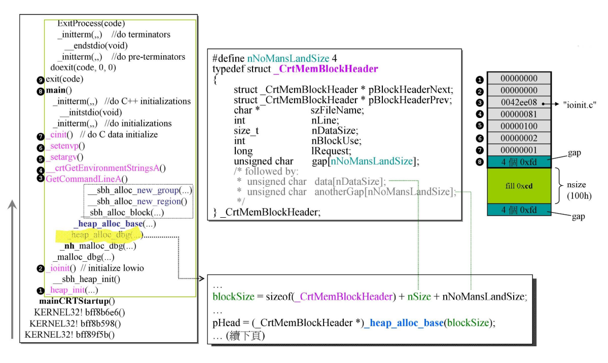

# `malloc & free`

> 胸中自有丘壑

## `VC6` 和 `VC10` 的 `malloc` 比较

- `mainCRTStartup` 做初始化准备工作，例如获取命令行参数、获取环境变量值，是通过调用相应的 `Windows` 系统调用来实现的。
- `CRT`: `C run time`，即 `C` 的标准库
- `heap_alloc_base` 函数进行了小区块的阈值判断，小于等于 `1016` 使用 `__sbh_alloc_block` 函数进行内存分配，否则使用系统函数 `HeapAlloc` 进行内存分配

- 划掉的是 `VC10` 中不存在的部分
- `heap_alloc_base` 函数没有对小区块的阈值判断了，而是统一使用系统函数 `HeapAlloc` 进行内存分配
- `VC10` 中没有 `SBH` 相关的操作了

## `SBH` 之始 —— `__heap_init()` 和 ` __sbh_heap_init()`

- 操作系统创建一块独特的空间并给其命名，之后相关操作所需的内存都取自这里（逻辑上分类）
  - `HeapCreate` 要求操作系统分配一块内存
  - `_crtheap` 全局指针变量，指向分配的内存空间，专为 `CRT` 使用
- `__sbh_heap_init()` 到 `_ctrheap` 指向的内存获取 `16 * sizeof(Header)` 空间
- 每个 `SBH` 中有 `16` 个 `HEADER`（当 `16` 个 `HEADER` 用光后，会再进行分配）

- 由 `HEADER` 数据结构知:
  - `2` 个指针，`pHeadData` 指向内存，`pRegion` 指向管理中心
  - `3` 个 `unsigned int` 型变量，每个 `unsigned int` 大小为 `4` 字节（`32bits`）
  - `bitvCommit` 为上面那行的 `32bits`，`bitvEntryHi` 和 `bitvEntryLo` 则合起来为下面那行的 `64bits`

- 在 `_sbh_heap_init()` 中含有对 `Header` 的配置，包括对所属的 `region` 的配置
- `pHeadData` 指向实际所管理的可分配的内存区块
- `pRegin` 指向管理 `Region` 区块，其中存储了所管理内存的控制信息
- `_heap_init()` 和 `__sbh_heap_init()` 调用完成之后就可以进行下一步 `_ioinit()`，使用 `SBH` 对小区块的内存请求进行响应和分配了

## `VC6` 内存分配

### `ioinit` 函数

- `ioinit` 函数发出了第一次内存分配请求
- `heap_init` 只是分配 `16` 个头，`HEADER` 里是什么东西是不清楚的
- 此处的申请 `32∗8=256bytes` 大小的内存，`ioinfo` 的大小为 `6`，对齐调整为 `8`

### `_heap_alloc_dbg` 函数

- `Debug` 模式下，`heap_alloc_dbg` 函数是在调整内存块的大小，此处的 `nSize` 就是上面提到的 `256bytes`
- 也即是说，在 `Debug` 模式下，需要的大小会被调整得更大一些（如右侧的图所示）
- 此时还没分配，只是在调整（扩大空间）
- `_CrtMemBlockHeader` 结构体变量说明：
  - `pBlockHeaderNext`: 指向链表后内存块
  - `pBlockHeaderPre`: 指向链表前内存块
  - `szFileName`: 记录申请使用该内存空间所在的文件
  - `nLine`: 记录申请使用该内存空间所在文件的行号
  - `nDataSize`: 实际数据区的空间大小（应用程序实际使用到的内存块）
  - `nBlockUse`: 表示当前内存块的类型: 如 `_CRT_BLOCK`、`_NORMAL_BLOCK` 等...
  - `IRequest`: 操作流水号
  - `gap[nNoMansLandSize]`，上下两处 `栏杆`，保护应用程序实际使用到的内存，到发生内存越界的情况，调试器可以检查到

- `heap_alloc_dbg` 函数此时是在调整指针
- 所有经过 `malloc` 分配的内存块都用链表串起来了，即使这块内存块已经给用户了，仍然在 `sbh` 的掌控之中，这是在调试模式下
- 之所以在调试器能追踪内存，因为在调试模式下，多了很多东西，反映到图上就是多了深灰色之外的东西
- 此处调用了 `memset` 给特定位置设置初值，以便观察后续的内存块变化情况；

### `_heap_alloc_base` 函数

- 此处的 `size` 是经过扩充调整后的大小，将这个大小与阈值进行比较
- 这个 `size` 目前还没加 `cookie`（`8bytes`），如果加上 `cookie` 后这个 `size` 小于 `1024`，它就是小区块，而现在还没加 `cookie`，所以此处是小于 `1016`

### `__sbh_alloc_block` 函数

- `intSize` 就是之前得到的内存块大小
- `2 * sizeof(int)` 就是加 `2` 个 `cookie`
- 最后的部分是在做 `RoundUp`，调整到 `16` 的倍数
- 也就是说通过 `malloc` 分配的内存的实际大小，也是真正消耗掉的内存大小，是要分配的大小经过调整补充再加上 `cookie`，最后调整为 `16` 的倍数
- 图中 `cookie` 记录的值是实际内存大小（图中一整块的大小），本来是 `0x130`，但是记录的却是 `0x131`，结尾的 `1` 表示这块内存已经被占用了，一旦被 `sbh` 回收，就会变成 `0x130`
- 从 `ioinit->_malloc_dbg->_nh_malloc_dbg->_heap_alloc_dbg->_heap_alloc_base->__sbh_alloc_block` 都是在计算内存的大小，还没真正进行内存分配，值还没设置

### `__sbh_alloc_new_region` 函数

- 此处真正进行内存分配
- `1` 个 `HEADER` 负责管理 `1MB`，通过管理中心进行管理
- 通过 `LISTHEAD` 知道，每个 `GROUP` 一共有 `64` 条双向链表
- 总结: `1` 个 `HEADER` 将会申请真正的内存 `1MB`，将来要分割出去的时候就从这块内存中进行分割，为了对这块内存切割后的内存块进行管理，又建立了 `REGION`，`REGION` 的大小是 `16k`

- `struct tagRegion` 里面:
  - `indGroupUse` 表示了当前会提供内存的 `group` 编号，从 `0` 开始
  - `cntRegionSize[64]` 用 `64` 个字节去对应当前 `group` 的展开链表，当对应链表挂载有内存时，将会变成 `1`，即最上面的深灰阴影的那一行
  - `bitvGroupHi` 和 `bitvGroupLo` 共同构成了一个的 `byteMap` 共 `64` 个 `byte`（分为 `32` 组），将来用于对应每个 `group` 中所挂载的 `64` 条双向链表，当对应的位置挂载有可用内存时，会变成 `1`
  - `grpHeadList` 就是 `32` 个 `group`，每个 `group` 负责 `32KB`

- `struct tagGroup` 里面:
  - `cntEntries` 表示当前链表中进行了分配或释放空间的次数（正数则代表分配操作，负数则代表释放回收操作，`0` 则表示系统已经将分配的空间全部回收或没有任何空间被分配使用）
  - `listHead` 对应 `64` 对指针，也就是形成了 `64` 条链表，用于挂载不同大小的内存块，间隔为 `16byte`，最后一条链表将挂载所有大于等于 `1K` 的内存块

- `struct tagListHead` 里面:
- 两个 `tagEntry` 类型的指针对象，即为上面 `Group` 表中的那 `64` 对指针

### `__sbh_alloc_new_group` 函数

- 从 `HEADER` 指向的内存从中分割内存块
- `32` 个 `Group` 逻辑上对应 `HEADER` 指向的内存（虚拟空间），将该内存切分为 `32` 个单元，每个单元就是 `32k`，每个单元又细分为 `8` 个 `page`，每个 `page` 的大小为 `4k`，`sbh` 设置一些指针，将这些 `page` 串起来

- `struct tagEntry` 里面:
  - `sizeFront` 表示链表剩余内存的大小，为了节省内存 `sizeFront` 借用了上一个 `Entry` 的 `pEntryPrev`。所以在 `Group` 中的 `64` 对某对链表指针没被投入使用时，一般都是往上指向前一个 `pEntryprev` 指针的地址从而向下包含 `3` 个的
  - `pEntryNext` 和 `pEntryPrev` 为嵌入式指针

- 对于每个 `page`，其有两个防护 `cooike`（`0xffffffff`），防止填充或合并内容时出现越界而修改其结构出错。`4096-2*4=4088`，又必须调整为 `16` 的倍数，所以调整为 `4080byte`，然后剩余的 `8byte` 作为无用的保留内容。

- 这里一开始是先实际分配了 `32KB` 的系统内存，`32KB` 分为 `8` 个 `4KB` 的 `page` 然后是挂在 `Group0` 下的最后一对即 `[63]` 指针上的。一直等到将 `Group0` 上的 `32KB` 分配完了再出现从（`1MB-32KB`）的系统内存空间再要一块 `32KB` 的然后归于 `Group1` 管控安排

- 将 `64` 对指针划分成各自负责的编号，即:
  - `[0]` 对指针负责大小为 `16byte` 的内存
  - `[1]` 对指针负责大小为 `32byte` 的内存
  - `[2]` 对指针负责大小为 `48byte` 的内存
  - ......
  - `[63]` 对指针此时应负责大小为 `1024byte` 的内存，且大于 `1KB` 即 `1024byte` 的都由最后这对指针负责，只有当切分到的内存空间小于 `1KB` 时才对应看应归属于前面的哪条链表，但此时也是有条件的，即使此时计算得出其归属于何种链表时，还应看此时该链表是否是可用状态

- 这就是从 `page` 中切割内存块的操作
图中 `0x130` 的就是切割出去的，红色的地址 `007d0ff8` 是传出去的地址，但是这是在 `debug` 模式下，所以这个地址还会继续调整，扣除 `debug header`，只将真正需要的内存地址传出去，这才是使用者真正拿到的地址，这个长度（`100h`）就是当初使用者申请的大小，这里的使用者就是当初的 `ioinit`
- 这个 `page` 还剩 `ec0=ff0−130`，其中 `ff0` 就是 `4080`
- 切割只是 `cookie` 的调整
- 展开的切割好的内存块中，前两个数据有错误，此处不是 `0` 了，而是对应的两个指针，第三个数据指向发出内存申请的文件名 `ioinit.c`，第 `4` 个数据是文件的哪一行发出的内存申请，第 `5` 个数据表示使用者真正需要的数据大小，第 `6` 个数据表示 `_CRT_BLOCK`，表示这一块是给 `CRT` 用的
- `main` 执行结束后，可能还有区块，这并不一定是内存泄漏，因为这可能是 `CRT` 在使用，查看 `nBlockUse` 变量是否为 `_CRT_BLOCK`，那么这就是合理的
- 在 `main` 结束之前的一刻，发现有 `_NORMAL_BLOCK` 的内存块，才说明存在内存泄漏
- `130h` 这一个区块应该由第 `304/16-1=18` 号链表供应

## `SBH` 行为分析

### 分配

#### 首次分配

- 需求: `ioinit.c` 的 `line#81` 申请 `100h`，经过调整区块大小为 `130h`
- `sbh` 面对这样的内存申请，在初始化的时候已经有 `16` 个 `HEADER`，现在第 `0` 个 `HEADER`，先通过`VirtualAlloc(0, 1Mb, MEM_RESERVE,...)` 分配 `1Mb` 的空间（从操作系统海量的内存中获得的空间）
  - `0`: 表示 `don’t care`，不在意从什么地方分配的空间
  - `1Mb`: 表示需要的大小
  - `MEM_RESERVE`: 保留，保留这个地址空间，不需要真的有内存在这个地址；
- 另一个指针通过 `HeapAlloc` 函数从 `_crtheap` 中获取到一块大小为 `sizeof(REGION)` 的内存空间，`REGION` 包含了 `32` 个 `Group`，每个 `Group` 包含 `64` 对指针
- 从 `1Mb` 中通过 `VirtualAlloc(addr, 32Kb, MEM_COMMIT)` 真正地划分出 `32K` 的内存，`1Mb` 空间中划分出了 `32` 个 `32K`，对应于 `32` 个 `Group`，将 `32K` 切成更小的单元即 `8` 个 `page`，这 `8` 个 `page` 各有两个指针，通过指针将这些 `page` 串起来，最后串回到 `64` 个链表的最后一个（之所以串回到最后一个链表，是因为每个 `page` 的大小为 `4080`，大于 `1k`，`64` 条链表分别管理的区块大小为 `16B`、`32B`、`48B`、...，而最后一个链表管理所有 `1k` 以上的区块，而目前这些 `page` 都是 `1k` 以上的，所以全部都归第 `64` 条链表管理）
- 以上就是为了第一次分配准备的内存
- 接下来开始切割，为了应付第一次的内存申请，`8` 个 `page`，从第一个 `page` 开始切，切割后给出去的 `130h` 大小的内存其中包含 `debug header` 以及无人区，而客户实际得到的地址是指向实际需要的大小 `100h` 的地址，在实际需要的内存大小 `100h` 的前后都有 `fdfdfdfd`，当用户获得指向 `100h` 的地址后，会往下写，可能会写到后面的 `fdfdfdfd` 中，而在回收的时候，调试器会检测 `fdfdfdfd` 是否被修改，如果被修改了，就会发出警告，这就是无人区，有隐患存在，是绝对不可以被改的内容。
- 申请 `100h`，调整后为 `130h`，理应由 `Group0` 的 `#18 list` 供应，但是现在只有 `#63 list` 链接着内存块，其他链表都是自己链接到自己（为空），当用户发出申请的时候，供应端会将自己的状况告诉用户端 ，`REGION` 中的 `64bits` 变量，对应于 `64` 条链表，哪条链表有链接着区块，对应的 `bit` 就会被设置为 `1`，否则为 `0`。当前的情况只有最后一条链表挂着区块，所以只有最后一个 `bit` 是 `1`，其他都是 `0`，每一行 `bits` 变量表示一个 `Group`，所以有 `32` 行 `bits` 变量

#### 第 `2` 次分配

- 某个申请 `x` 字节的内存，经过添加 `Debug header`、`cookie`，以及调整为 `16` 的倍数后需要的内存大小为 `240h`，通过计算得到应该由 `#35 list` 供应，接着就去检查 `Group0` 的 `64bit` 变量中的第 `35` 号对应的 `bit` 是 `0` 还是 `1`，目前只有最后一个 `bit` 对应的值为 `1`，其他都是 `0`，也就是说应该供应的 `#35 list` 为空，只能退而求其次，找比较大的，目前只有最后一条链表，从之前的 `page1` 中剩余的内存中切割
- `Group` 结构体中的 `cntEntries` 变量，当需要分配的时候 `+1`，回收的时候 `-1`，当值为 0 的时候，表示 `8` 个 `page` 可以全部收回来，还给操作系统
- 图中 `Region` 区域的红色的 `0` 表示正在使用 `Group0`，如果 `Group0` 的 `8` 个 `page` 都使用完后，就继续往下使用 `Group1`，...

#### 第 `3` 次分配

- 申请的 `70h`，在 `sbh` 先检查应该由第几号链表供应刚刚好，结果发现其对应的链表的 `bit` 是 `0`，于是只好找最靠近的有区块链接的链表，找到了最后一个链表
- 从最后一个链表中找到 `page1`，从剩下的内存中划分 `70h`

#### 第 `15` 次释放

- `14->13`，释放，要先减一
- 这次还的是第 `2` 次分配的 `240h`，调用 `free` 进行释放，归还到 `#35 list`，挂到 `35` 号链表上，回收的方式就是将这块内存的 `cookie` 里的 `241` 修改成 `240`，就表示进行了回收，相关的数字进行修改
- 修改 `64bit` 变量中对应的第 `36` 个 `bit`（表示 `35` 号链表）的数字为 `1`，（`00000000 10000001`，其中每一位表示 `4bit`）

#### 第 `16` 次分配

- 需要分配 `b0h`，应该由 `#10 list` 供应，但是检查 `bit` 位发现第 `11` 个 `bit` 值为 `0`，就要往比较大的区块进行查找，`#35 list` 有区块，所以应该由 `#35 list` 供应，`#35 list` 刚刚回收了 `240h` 的内存，所以从这块内存里切
- `240h` 切出去 `b0h`，还剩 `190h`，这个内存块变小了，就要进行移动，通过计算 `190h/10h−1=24`，应该挂在 `#24 list` 上，所以第 `25` 个 `bit` 应该从 `0` 修改为 `1`
- 这个过程就是第 `15` 次的时候刚刚回收了 `240h` 的内存，第 `16` 次分配的时候就要从刚刚回收的内存中进行切割，剩下的内存块（`190h`） 比较小，就进行移动，对应的 `bit` 也要进行调整

#### 第 `n` 次分配

- 第 `n` 次分配设计的是 `Group1` 的区块不足够，相对应的要划分一块 `32k` 的内存，将它划分为 `8` 个 `page`，这是一个新的 `Group`，之前的 `Group1` 中的 `32k` 的使用状态是 `02000014 00000000`，里面有 `3` 个链表挂了区块，有几块不知道
- 第 `n` 次分配需要 `230h` 的内存大小，之前 `Group1` 上的链表挂的区块不能满足这个要求，于是新启动一个 `Group2`（图中的数字变成了 `1`），其他的操作都是一样的

### 区块合并

- 如果回收的内存是相邻的，是不是应该合并呢？好的设计应该是要合并的
- 图中空白的区块表示已经回收了的，阴影部分表示可以进行回收的区块
- 目前图一中的待回收的内存块前后都是已经回收的 `300h` 大小的内存块，这两个内存块都落在 `#(300h/10h-1)` 这条链表上，要归还目前这个阴影内存块，就要去判断上面和下面是不是都是已经是回收的内存块，这就谈到为什么要有上下 `cookie`。直观地想，`cookie` 是记录整个内存块的大小，应该只需要一个就好了，为什么上下都有一个一模一样的 `cookie` 呢
- 回收的步骤:
  - 先将待回收的内存块的 `cookie` 中的 `1` 修改为 `0`
  - 图中箭头所在的地方的指针往上 `4` 个字节，知道了长度为 `300h`，从这个地址开始加上 `300h` 到达了下一块内存的起点，即 `cookie`，能够去检查最后一个 `bit`，发现是 `0`，所以这两块内存可以合并
  - 因为上下都有 `cookie`，所以从图一的箭头处的位置往上 `4` 个字节，再往上 `4` 个字节，就到达了上一个内存块的 `cookie`，知道了上一个内存块的大小，且知道了最后一个 `bit` 是 `0`，于是可以继续往上调 `300h` 到达了上一个内存块的上 `cookie` 位置，将它们进行合并
- `sbh` 系统计算 `900h` 应该链到哪条链表上
- 所以，如果没有下 `cookie` 的设计，就无法管理上方区块的合并

### `free(p)`

- 首先要知道落在哪一个 `1Mb` 之中（一个 `Header` 对应一个 `1Mb` 的内存），在这 `1Mb` 中又要知道落在 `32` 段的哪一段之中，知道是哪一段就知道了对应于哪一个 `Group`，然后才能去除以 `16` 再减 `1`，确定链在哪个链表上
- 指针 `p` 如何知道是哪个 `Header`？最开始有 `16` 个 `Header`，`__sbh_pHeaderList` 指向这 `16` 个 `Header`，每个 `Header` 的大小是固定的。回收的时候知道内存块的大小，通过 `p+` 内存块的大小，计算属于哪个 `Header`，如果找不到，则说明当初不是从这里分配出去的，找到属于哪个 `Header` 后，将该指针减去这个 `1Mb` 的头指针再除以 `32k`，计算得到位于 `1Mb` 的哪个段（如果从 `0` 算起，还要减 `1`）
- Q: 落在哪个 `Header` 内？
  - A：每个 `Header` 都有指针指向 `1Mb` 的内存块，且这个内存块的大小也知道了，于是通过计算 `头+内存块大小`，可以知道 `p` 是落在哪个 `Header` 内了。
- Q: 落在哪个 `Group` 内？
  - A: `p` 减去 `1Mb` 的头指针，除以 `32k`，就知道落在第几段，也就落在哪个 `Group` 内。
- Q: 落在哪个 `free-list` 内？（被哪个 `free-list` 链住？）
  - A: 指针往上看就是 `cookie`，通过 `cookie` 知道了内存块的大小，然后除以 `10h` 再减去 `1`，就知道落在哪个链表；

### 分段管理之妙

- 一段是 `32k`，切成 `8` 块
- 如何判断全回收？
  - 如果链表全部变成 `0` 就表示全部给出去了，那么如何判断全回收呢？`Group` 中有 `cntEntries` 变量，只要这个值变成 `0`，就表示全回收
- 全回收的时候回到了初始的状态（首次分配），`8` 个 `page` 不能再进行合并，因为并不急着还给 `os`，方便下一次的分配，等到下一次全回收才会归还给 `os`。只有手上有两个全回收的时候才会归还给系统

- 恢复到初始状态。图中的 `8` 个 `page` 是不会合并的

## `VC malloc` + `GCC allocator`

- `GCC` 的 `allocator` 的原理和 `VC` 的 `malloc` 是相似的，`allocator` 中有 `16` 条链表，管理的区块最高到 `128B`，每次需要的时候向 `malloc` 要内存，`allocator` 中的 `16` 条链表的设计不是为了速度快，因为 `malloc` 已经很快了，目的是为了去除 `cookie`

`CRT`（`malloc`/`free`） 是 `C` 的层次，是跨平台的，并不依附于哪个操作系统，所以它并不能预设下面的操作系统有没有做内存管理，同样的道理，`C++ Library`（`std::allocator`）最终要调用到 `CRT`（`malloc`/`free`），它也不能去预设 `malloc` 有没有做内存管理，因为它是 `C++` 的标准库，不能依赖于底层 `C` 的东西。