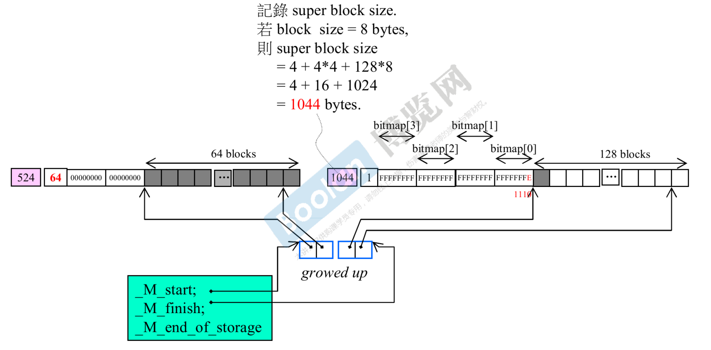

# `other issues`

## `GNU C++` 对 `allocators` 的描述

将元素加入容器中，容器必须分配更多内存以保存这些元素，于是它们向其模板参数 `Allocator` 发出申请，该模板参数往往被另名为 `allocator_type`。甚至将 `chars` 添加到 `string class` 也是如此，因为 `string` 也算是一个正规的 `STL` 容器。

每个元素类型为 `T` 的容器的 `Allocator` 模板实参默认为 `allocator<T>`。其接口只有大约 `20` 个 `public` 声明，包括嵌套的 `typedefs` 和成员函数。最重要的两个成员函数是:

```cpp
T* allocate(size_type n, const void* hint=0);
void deallocate(T* p, size_type n);
```

`n` 指的是客户申请的元素个数，不是指空间总量。

这些空间是通过调用 `::operator new` 获得，但何时调用以及多么频繁调用并无具体指定。


- `__gnu_cxx::new_allocator` 和 `__gnu_cxx::malloc_allocator` 没有什么特殊的设计，没有内存池的设计，这就是最容易满足需求的做法
- `__gnu_cxx::new_allocator` 相对来说稍微好一些，因为 `::operator new` 可重载

另一种作法就是使用智能型 `allocator`，将分配所得的内存加以缓存。这种额外机制可以数种形式呈现:

- 可以是个 `bitmap index`，用以索引至一个以 `2` 的指数倍成长的篮子
- 也可以是个相较之下比较简易的 `fixed-size pooling cache`，`fixed-size pooling cache` 固定大小的内存池缓存，就是之前提到的 `16` 条链表，每条管理不同大小的内存块，内存块都是 `8` 的倍数

这里所说的 `cache` 被程序内的所有容器共享，就是之前提到的先准备一大块内存，然后慢慢划分，最大的优势是去除 `cookie`，同时 `operators new` 和 `operator delete` 不经常被调用，这可带来速度上的优势。

使用这类技巧的 `allocators` 包括:

```cpp
__gnu_cxx::bitmap_allocator // 一个高效能 allocator，使用 bit-map 追踪被使用和未被使用的内存块
__gnu_cxx::pool_allocator
__gnu_cxx::__mt_alloc
```

`__gnu_cxx::__mt_alloc` 是多线程的 `allocato`


`Class allocator` 只拥有 `typedef`，`constructor`，和 `rebind` 等成员。它继承自一个 `_high-speed extension allocators`。也因此，所有分配和归还都取决于该 `base class`，而这个 `base class` 也许是终端用户无法碰触和操控的。

另两个智能型 allocator:

```cpp
gnu_cxx::debug_allocator
```

这是一个外覆器，可包覆于任何 `allocator` 之上。它把客户的申请量添加一些，然后由 `allocator` 回应，并以那一小块额外内存放置 `size` 信息。一旦 `deallocate()` 收到一个 `pointer`，就会检查 `size` 并以 assert() 保证吻合。

```cpp
gnu_cxx::array_allocator
```

允许分配一已知且固定大小的内存块，内存来自 `std::array objects`。用上这个 `allocator`，大小固定的容器就无需再调用 `::operator new` 和 `::operator delete`。

`C++` 的数组，是静态的，不是动态的，因此避免了在运行期添乱、增加开销。

甚至在 `program startup` 情况下也可使用，在进入程序员编写的程序 `main` 之前就可以使用 `__gun_cxx::array_allocator` 了，也就是说还没有准备好动态分配的时候，就已经有 `__gun_cxx::array_allocator` 了。不过在 `VC6` 下的 `startup` 被写成了一个函数 `mainCRTStartup()`。

## `VS2013` 标准分配器与 `new_allocator`


没有做什么额外操作的分配器。

## `G4.9` 标准分配器与 `new_allocator`


标准库中的默认分配器，没有做什么额外操作的分配器。

## `G4.9` `malloc_allocator`


### `G4.9` `array_allocator`


第二模板参数不管是使用 `std::tr1::array` 还是 `std::array` 都一样，因为本质相同，底部是一个 `C++` 的数组。

`C++` 的数组是静态的，不需要释放，不需要归还，所以 `array_allocator` 里面只有 `allocate()` 函数，如果调用 `deallocate()` 则是调用的父类的接口，但是这个接口里面 `do nothing`。


`array_allocator<int, array<int, 65536>> myalloc(&my);` 调用构造函数，其中 `myalloc` 是对象名称。


其中
```cpp
typedef ARRAY std::array<int, 65536>;
ARRAY* pa = new ARRAY;
```

这两行代码等同于上一个图中的 `int my[65536];` 区别在于，`int my[65536];` 是静态数组，而这两行是使用动态分配的方式分配的内存。

## `G4.9` `debug_allocator`


`sizeof(size_type)` 在绝大多数系统中都是 `4`，记录区块的大小。

`_S_extra()` 函数的结果表示额外的内存相当于几个元素。

包裹另一个分配器，让分配的区块还多带 `extra` 的空间，用于记录整个区块的大小，扮演的角色类似于 `cookie`。

## `G4.9` `bitmap_allocator`


容器一次都会只要一个元素。否则调用 `operator::new()`

### 关于 `blocks`，`super-blocks`，`bitmap`，`mini-vector`


`blocks` 就是客户需要的，一次性申请 `64` 个 `blocks` 用来后续的供应。

`super-blocks = 64个blocks + bitmap + use count`。

`bitmap` 记录了 `blocks` 的使用情况，一个 `bit` 位表示 `1` 个 `block`，`1` 表示在手中，`0` 表示给出去，当前的状态是全部都在手中。

`use count` 表示使用了几个 `block`，目前的状态是 `0` 个被使用
`block size` 是 `8` 的倍数，`8`，`16`，`24`... 这样的增长，只允许这样的大小，图中假设每个 `block` 的 `size` 是 `8`，所以 `super block size = 524 bytes`。

`__mini_vector` 中的一个元素表示一个 `super blocks`。


使用了第 `1` 个 `block`，`bitmap` 的变化次序和 `blocks` 的变化次序相反，`blocks` 从左往右，`bitmap` 从右往左，`bitmap` 的最后一个 `bit` 变成 `0`。


分配了第二个 `block`，`bitmap` 的倒数第二个 `bit` 变成 `0`，`use count` 变成 `2`。


使用了 `63` 个 `blocks`，只有最后一个 `block` 没有使用，所以对应 `bitmap` 的第一位为 `1`，其他都为 `0`。


将倒数第三个 `block` 归还，`use count` 变成 `62`，相对应的 `bit` 为变成 `1010`。

### `1st super-block` 用罄，启动 `2nd super-block`



第二个 `super-block` 一共有 `128` 个 `blocks`，就需要 `128` 个 `bit`，即 `4` 个整数（每个整数 `32` 位）。

第二个 `super-bloc` 的第 `1` 个 `block` 给出去了，所以 `bitmap[0]` 的最后 `1` 个 `bit` 变成了 `0`。

标准库中的 `vector` 当空间不够的时候会进行 `2` 倍的增长，此处的 `_mini_vector` 就是实现了一个和标准库中的 `vector` 相似功能的容器，这里出现了数据的搬动，`_M_start` 此时的值和只有一个元素的时候的 `_M_start` 的值是不一样的。

### `2nd super-block` 用罄，启动 `3rd super-block`


第三个 `super-block` 一共有 `256` 个 `blocks`，需要 `256bit` 来表示每个 `block` 被使用的状态，即 `8` 个整数，此时 `_mini_vector` 需要有第三个单元来控制第三个 `super-block`，因为 `_mini_vector` 是成倍增长的，所以此时有 `4` 个单元，但是最后一个单元还没被使用。

- 每个 `super-block` 只为一种 `value type` 服务，图中的蓝色格子，每两格表示一个 `entry`。

### `1st super-block` 全回收


回收的时候使用了另一个 `_mini_vector`，叫做 `_S_free_list`。

当前的 `super-block` 已经是 `256blocks`，因为回收了 `1st super block`，所以下次再分配的时候，分配规模为 `128blocks`。回收的 `vector` 中只存放 `64` 个 `super-block`，如果有第 `65` 个 `super-block` 回收了，就会归还给 `OS`，回收了的 `super-block` 要将 `_mini_vector` 中的这个 `entry` 移除，后面的 `entry` 元素要往前推。

### `2nd super-block` 全回收


### `3rd super-block` 全回收

