# `C++ memory primitives`

> 万丈高楼平地起

## `C++` 应用程序

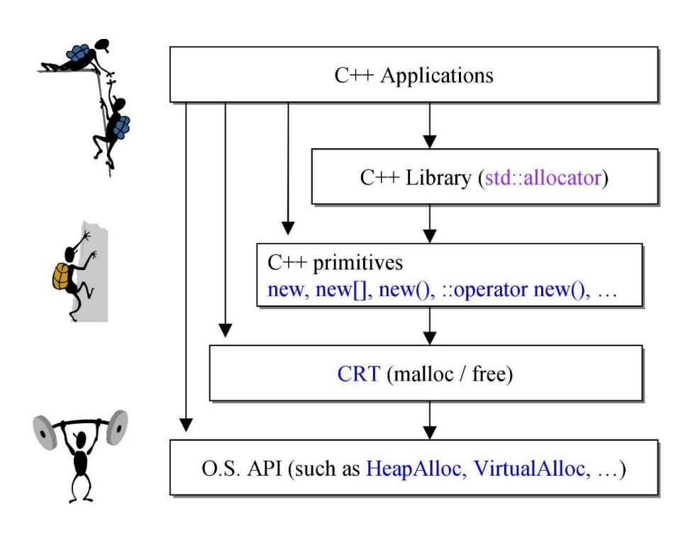

`C++` 应用程序可以通过多种方式调用内存分配的接口。

## `C++ memory primitives`

|分配|释放|类属|可否重载|
|-|-|-|-|
|`malloc()`|`free()`|`C` 函数|不可|
|`new`|`delete`|`C++` 表达式|不可|
|`::operator new()`|`::operator delete()`|`C++` 函数|可以|
|`allocator<T>::allocate()`|`allocator<T>::deallocate()`|`C++` 标准库|可自由设计并搭配容器|

在编程时可以通过上表的几种方法直接或间接地操作内存。

对于 `GNU C`，`4` 种分配与释放方式如下:

```cpp
    cout << "\ntest_primitives().......... \n";

    void* p1 = malloc(512); // 512 bytes
    free(p1);

    complex<int>* p2 = new complex<int>; // one object
    delete p2;

    void* p3 = ::operator new(512); // 512 bytes
    ::operator delete(p3);

#ifdef __GNUC__
    printf("hello gcc %d\n", __GNUC__);
    // 以下两个函数都是 non-static，要通过 object 调用。分配 7 个 int
    int* p4 = allocator<int>().allocate(7);
    allocator<int>().deallocate(p4, 7);

    // 以下两个函数都是 non-static，要通过 object 调用。分配 9 个 int
    int* p5 = __gnu_cxx::__pool_alloc<int>().allocate(9);
    __gnu_cxx::__pool_alloc<int>().deallocate(p5, 9);
#endif
```

用宏来区分，是因为虽然是标准接口，但在不同的环境下不同的使用方式效率不同。

### 测试代码

[test01](./../src/test01.cpp)

## `new expression`

当使用 `new` 时:

```cpp
Complex* pc = new Complex(1,2);
```

`new expression` 会被转换为:

```cpp
Complex *pc;
try {
    // operator new 实现自 new_op.cc
    void* mem = operator new(sizeof(Complex)); // allocate
    pc = static_cast<Complex*>(mem);    // cast
    pc->Complex::Complex(1, 2); // construct
    // 注意: 只有编译器才可以像上面那样直接呼叫 ctor，欲直接调用 ctor 可通用 placement new: new(p)Complex;
}
catch(std::bad_alloc) {
   // 若 allocation 失败就不执行 constructor
}
```

- `new` 的操作是: 分配内存，调用构造函数
- `::operator new()` 是全局的函数，而该函数可以重载，如果它被重载了，那么调用的就是重载的函数，而此处的 `Complex` 类并没有重载 `operator new()`，所以调用的就是全局的 `::operator new()`
- 在函数 `operator new` 中调用了 `malloc`
- 有编译器才可以直接调用构造函数，如果程序想直接调用构造函数，可以使用 `palcement new` 的方式: `new(p) Complex(1, 2)`

## `delete expression`

当 `delete` 上述对象时:

```cpp
delete pc;
```

`delete expression` 会被转换为:

```cpp
pc->~Complex(); // 先析构
operator delete(pc); // 然后释放内存
```

`delete` 操作步骤:
- 第一步调用了对象的析构函数
- 第二步通过 `operator delete()` 函数释放内存，本质上也是调用了 `free` 函数

## `new` 和 `delete` 的相关源码

[libsupc++](https://github.com/gcc-mirror/gcc/tree/master/libstdc++-v3/libsupc++)

```cpp
// gcc-4.9.2\libstdc++-v3\libsupc++\new
void* operator new(std::size_t) _GLIBCXX_THROW (std::bad_alloc)
  __attribute__((__externally_visible__));
void* operator new[](std::size_t) _GLIBCXX_THROW (std::bad_alloc)
  __attribute__((__externally_visible__));
void operator delete(void*) _GLIBCXX_USE_NOEXCEPT
  __attribute__((__externally_visible__));
void operator delete[](void*) _GLIBCXX_USE_NOEXCEPT
  __attribute__((__externally_visible__));

// gcc-4.9.2\libstdc++-v3\libsupc++\new_op.cc
_GLIBCXX_WEAK_DEFINITION void *
operator new (std::size_t sz) _GLIBCXX_THROW (std::bad_alloc)
{
  void *p;

  /* malloc (0) is unpredictable; avoid it.  */
  if (sz == 0)
    sz = 1;
  p = (void *) malloc (sz);
  while (p == 0)
    {
      new_handler handler = std::get_new_handler ();
      if (! handler)
    _GLIBCXX_THROW_OR_ABORT(bad_alloc());
      handler ();
      p = (void *) malloc (sz);
    }

  return p;
}

// gcc-4.9.2\libstdc++-v3\libsupc++\new_opv.cc
_GLIBCXX_WEAK_DEFINITION void*
operator new[] (std::size_t sz) _GLIBCXX_THROW (std::bad_alloc)
{
  return ::operator new(sz);
}

// gcc-4.9.2\libstdc++-v3\libsupc++\del_op.cc
_GLIBCXX_WEAK_DEFINITION void
operator delete(void* ptr) _GLIBCXX_USE_NOEXCEPT
{
  std::free(ptr);
}

// gcc-4.9.2\libstdc++-v3\libsupc++\del_opv.cc
_GLIBCXX_WEAK_DEFINITION void
operator delete[] (void *ptr) _GLIBCXX_USE_NOEXCEPT
{
  ::operator delete (ptr);
}
```

## `Ctor` & `Dtor` 直接調用

```cpp
string* pstr = new string;
cout << "str="<< *pstr << endl;
// lpstr->string::string("test") ;
//! pstr->string() ;// crash

class A {
public:
    int id;
    A(int i) : id(i) { cout << "ctor. this=" << this << " id=" << id << endl; }
    ~A() { cout<< "dtor. this=" << this << endl; }
};

A* pA = new A(1);
cout << pA->id << endl;
//! pA->A::A(3);
//! A::A(5);
cout << pA->id << endl;
delete pA;
```

通过指针调用构造函数: `pstr->string::string("test");` 编译会失败。

第二段和第三段代码是自定义的类，`pA->A::A(3);` 在 `VC6` 中执行会成功，而在 `GCC` 中则会执行失败，`GCC` 更加严谨，`A::A(5);` 在 `VC6` 中也执行成功，在 `GCC` 中执行失败。

总之，不能直接调用构造函数。

### 测试代码

[test02](./../src/test02.cpp)

## `array new`、`array delete`

当 `new` 一个数组对象时（例如 `new Complex[3];`），编译器将分配一块内存，这块内存首部是关于对象内存分配的一些标记，然后下面会分配三个连续的对象内存，在使用 `delete` 释放内存时需要使用 `delete[]`。

```cpp
Complex* pca = new Complex[3];
// 唤起三次 ctor
// 无法藉由参数给与初值
...
delete[] pca; // 唤起三次 dtor
```

在调用 `delete[]` 的时候，需要知道该数组中有几个对象，以便每个对象都去调用析构函数。因此，存储该值非常的重要，下图中的 `cookie` 便会存储数组元素个数信息，这里需要额外说明的是:
- 当数组中分配的是类对象的时候，即存在构造和析构函数，才会需要记录这个数组的大小，用于释放的时候能保证调用相应次数的析构
- 使用 `malloc` 分配到的内存，也存在 `cookie` 信息，但与该处表示的含义不太一样

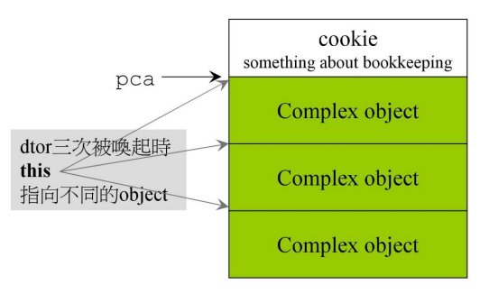

```cpp
string* pca = new string[3]; // 唤起三次 ctor
...
delete pca; // 唤起一次 dtor
```

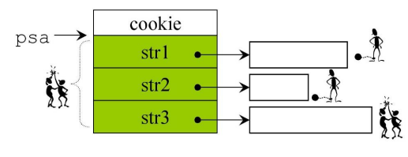

如果不使用 `delete[]`，只是使用 `delete` 只会将分配的三块内存空间释放，但不会调用对象的析构函数:
- 对 `class without ptr member` 可能没影响
- 对 `class with pointer member` 通常有影响

编译器在处理 `array new` 的时候是从上往下，而 `array delete` 则是从下往上。

自定义的类一定要写默认构造函数，因为使用 `array new` 的时候是没有办法设置初值的，调用的就是默认构造函数。

使用 `placement new` 来设置初值：`new(tmp++)A(i);`， 在 `tmp` 这个地址放置一个对象。

## `array size, in memory block`

下图是 `VC6` 的 `malloc` 的内存布局:

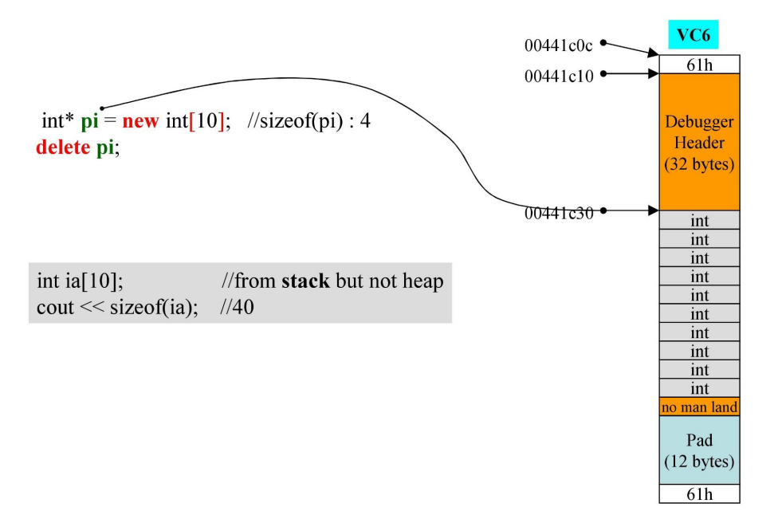

如果使用 `new` 分配 `10` 个 `int`，内存空间如上图所示，`61h` 是 `cookie`，记录内存的大小 `60h`，`1` 表示这块内存使用了，黄色部分为 `debug` 信息，灰色部分才是真正使用到的内存，蓝色部分的 `12 bytes` 是为了让该内存块以 `16` 字节对齐。

此处的 `int` 的析构函数是无意义的，`delete pi` 和 `delete[] pi` 效果是一样的，因为 `int` 没有析构函数。但是如果释放的对象的析构函数有意义，`array delet` 就必须采用 `delete[]`，否则发生内存泄露。

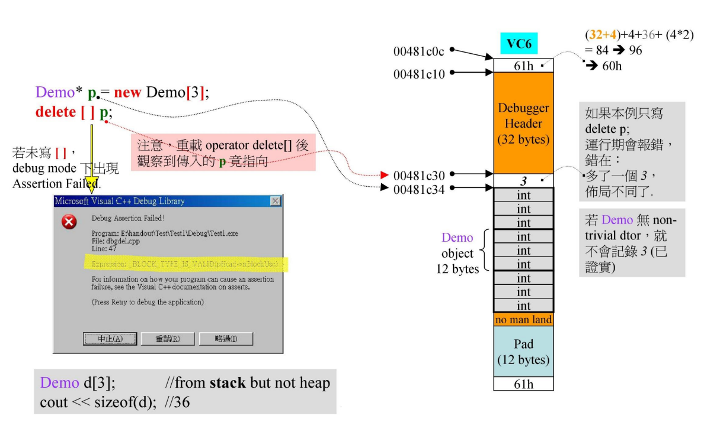

上图通过 `new` 申请三个 `Demo` 空间大小，内存块使用了 `96 byte`: 
- `debug` 信息 `32 + 4 = 36 byte`
- `debug` 信息下面的 `3` 用于标记实际分配给对象内存个数，这里是三个所以里面内容为 `3`，消耗 `4 byte`
- `Demo` 内有三个 `int` 类型成员变量，一个 `Demo` 消耗内存 `3 * 4 = 12 byte`，由于有三个 `Demo`，所以消耗了 `12 * 3 = 36 byte` 空间
- 头尾 `cookie` 一共 `8 byte`
- 目前一共消耗 `84 byte`，由于以 `16` 字节对齐，所以填充蓝色部分为 `12 byte`,一共消耗了`84 + 12 = 96 byte`。

内存中会有一个表示分配的对象个数的数，例如此处的 `3`，`delete[] p;` 的时候，因为有 `[]`，底层执行 `free` 的时候发现对象个数是 `3`，于是就调用 `3` 次析构函数，如果不加 `[]` 就会报错。

## `placement new`

`placement new` 允许我们将 `object` 建构于 `allocated memory` 中。

没有所谓 `placement delete` 因为 `placement new` 根本没分配 `memory`。

它的返回值就是它传入的指针，它的作用的是允许我们能够在指定的位置调用构造函数。

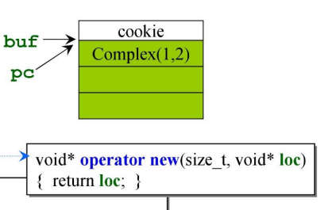

```cpp
Complex* buf = new Complex;
Complex *pc = new(buf)Complex(1, 2);
delete[] buf;
```

上述被编译器编译为:

```cpp
Complex *pc;
try {
    void* mem = operator new(sizeof(Complex), buf); // allocate
    pc = static_cast<Complex*>(mem); // cast
    pc->Complex::Complex(1, 2); // construct
} catch (std::bad_alloc) {
    // 若 allocation 失败就不执行 construct
}
```

### 测试代码

[test03](./../src/test03.cpp)

## `C++` 应用程序，分配内存的途径

应用程序:

```cpp
Foo* p = new Foo(x);
...
delete p;
```

表达式不可重载。

相当于如下代码:

```cpp
Foo* p = (Foo*)operator new(sizeof(Foo));
new (p)Foo(x);
...
p->~Foo();
operator delete(p);
```

这里 `operator new()` 和 `operator delete()` 等于:

```cpp
::operator new(size_t);
::operator delete(void*);
```

`::operator new()` 和 `::operator delete()` 是全局函数，最终调用:

```cpp
malloc(size_t);
free(void*);
```

但我们可以重载 `operator new()` 和 `operator delete()`:

```cpp
Foo::operator new(size_t);
Foo::operator delete(void*);
```

但最后还是要调用到全局的 `::operator new()` 函数。

全局的 `::operator new()` 也可重载，但是影响较大，比较少见。

当然也可以模仿 `new expression`:

```cpp
Foo* p = (Foo*)malloc(sizeof(Foo));
new (p)Foo(x);
...
p->~Foo();
free(p);
```

### 测试代码

[test04](./../src/test04.cpp)

## `C++` 容器，分配内存的途径

容器背后使用的 `allocate()` 函数最后也是调用了全局的 `::operator new()` 函数。

```cpp
// 把一个元素放进 Container<T> 里，Container<T> 也要 new 一份空间，对元素进行 copy
T* p = allocate();
construct();
...
destroy();
deallocate p;
```

容器将构造函数包装为 `construct()`，析构函数包装为 `destroy()`。

`allocate` 和 `deallocate` 交给分配器 `std::allocator`。

分配器本质上还是调用 `::operator new()` 和 `::operator delete()`。

```cpp
::operator new(size_t);
::operator delete(void*);
```

## 重载

### 重载 `::operator new` / `::operator delete`

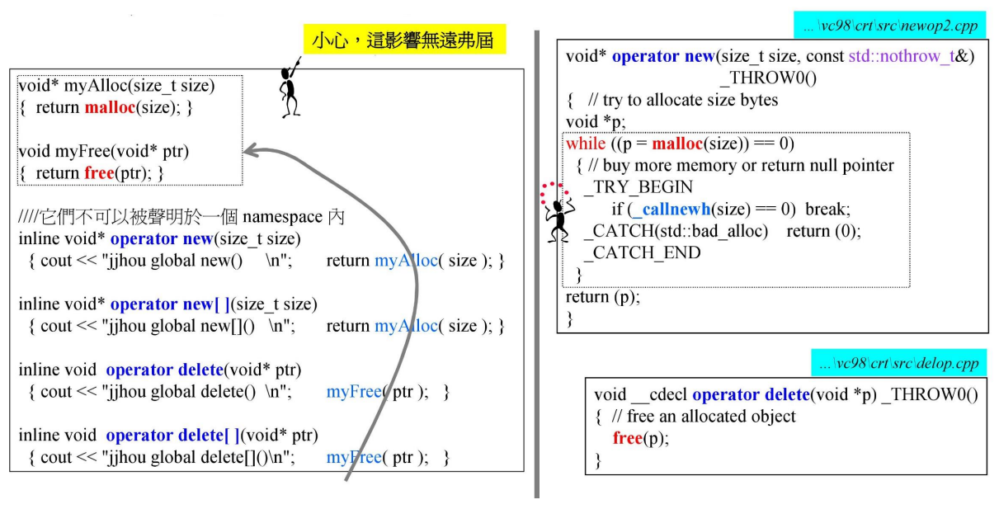

上面这张图演示了如何重载全局的 `::operator new()` 函数，即类外重载，但一般不推荐重载 `::operator new()` 函数，因为它对全局有影响，如果使用不当将造成很大的问题。

### 重载 `operator new` / `operator delete`

如果是在类中重载 `operator new()` 方法，必须保证函数参数列表第一个参数是 `size_t` 类型变量，对于 `operator delete()`，第一个参数必须是 `void*` 类型，第二个 `size_t` 是可选项，可以去掉。

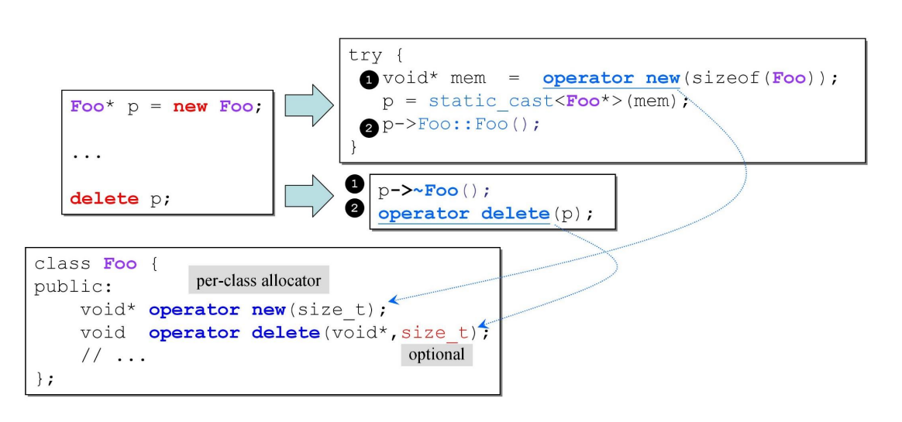

进行 `Foo* p = new Foo;` 和 `delete p;` 时，调用的就是重载后的。

### 重载 `operator new[]` / `operator delete[]`

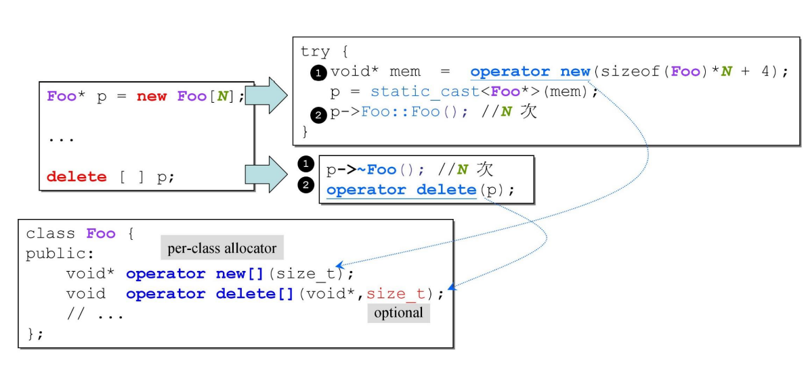

对于 `operator new[]` 和 `operator delete[]` 函数的重载，和前面类似。

`C++` 类大小是由类中的成员变量决定的（静态成员变量除外），由于成员函数放到代码区由类的各个实例共享，故成员函数对类占用内存大小没有影响。具体地说，类占用内存大小由以下三个方面决定:
- 非静态成员变量的内存占用之和
- 考虑内存对其的问题
- 虚函数产生的额外内存开销，即虚函数表指针

如果调用 `new` 和 `delete` 时，写上 `global scope operator ::`，会绕过 `overloaded functions`，强迫使用 `global version`。

### 测试代码

[test05](./../src/test05.cpp)

### 重载 `new()` / `delete()`

我们可以重载 `class member operator new()`，写出多个版本，前提是每一版本的声明都必须有独特的参数列，其中第一参数必须是 `size_t`，其余参数以 `new` 所指定的 `placement arguments` 为初值。出现于 `new(.....)` 小括号内的就是所谓 `placement arguments`。

```cpp
Foo* pf=new(300, 'c') Foo;
```

我们也可以重载 `class member operator delete()`，写出多个版本。但它们不会被 `delete` 调用。只有当 `new` 所调用的 `ctor` 抛出 `exception`，才会调用这些重载版的 `operator delete()`。它只可能这样被调用，主要用来归还未能完全创建成功的 `object` 所估用的 `memory`。

### 测试代码

[test06](./../src/test06.cpp)

### `basic_string` 使用 `new(extra)` 扩充申请量

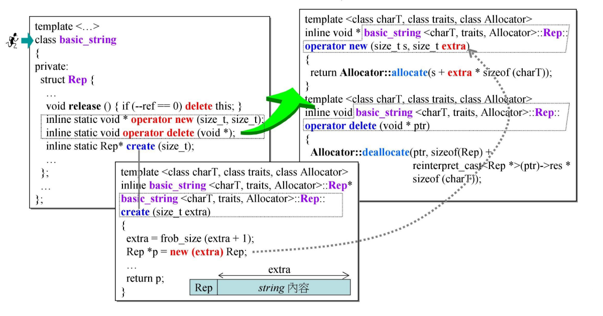

标准库里的 `string` 其实就是 `typedef` 的 `basic_string`。

`basic_string` 重载了 `operator new()`，每次创建字符串的时候都多带了一包东西，所以需要 `extra`。

## `allocator`

### `per-class allocator 1`

针对于某个类设计小型的分配器（内存池），重载的 `operator new()` 和 `operator delete()` 默认为 `static` 的。

设计思路为:

每个类重载 `operator new()`，申请内存时，如果链表上没有可用的内存块时，一次性申请 `screenChunk * Screen` 个字节的内存，并把它们用指针连接起来，返回链表的头节点，头节点向后偏移，如果有可用的内存块，直接返回链表的头节点，头节点向后偏移。

每个类重载 `operator delete()`，将该类的内存块头插法插入链表。修改原链表头节点。

这种设计方法多耗用一个 `next` 的指针，并且没有释放内存，但是不能算内存泄漏，因为该类管理着所有的内存。

### 测试代码

[test07](./../src/test07.cpp)

### `per-class allocator 2`

设计思路为:

`Airplane* next;` 借用同一个东西的前 `8` 个字节当成指针来使用，这种方法叫做 `embedded pointer`，所有内存管理都用了这种技巧。

为了内存对齐，`struct AirplaneRep` 的大小为 `16` 字节。

将收回来的指针放入单向链表的头，但是没有还给操作系统。

写了 `member operator new/delete` 的间隔是 `16`，从间隔可以看出，对象都是紧紧相连的，没有耗用掉 `cookie`。而使用 `global opeartor new/delete` 的，每个对象的前后都有 `cookie`，所以间隔是 `32`。

### 测试代码

[test08](./../src/test08.cpp)

第二版本相比于第一版的优点，使用了 `union`，用前 `8` 个字节当成指针来使用，即 `embedded pointer` 方法。

但是还是有个小缺点: 收回来的指针全部累计起来了，如果能还给操作系统就更好了。

### `static allocator`

前面的设计的分配器需要为不同的 `classes` 重写一遍几乎相同的 `member operator new` 和 `member operator delete`，应该有方法将一个总是分配特定尺寸区块的 `memory allocator` 概念包装起来，使它容易被重复使用，即将内存的动作抽取到单一的 `class` 中。

每个 `allocator object` 都是个分配器，它体内维护一个 `free-lists`，不同的 `allocator objects` 维护不同的 `free-lists`。

每次开辟的 `5` 个元素在内存中都是相邻的，但是这一组元素与另外开辟的 `5` 个元素不一定是相邻的。

### 测试代码

[test09](./../src/test09.cpp)

### `marco for static allocator`

因为每个使用 `allocator` 的类的几处写法是固定的，于是将它们写成宏:

```cpp
//DECLARE_POOL_ALLOC -- used in class definition
#define DECLARE_POOL_ALLOC()\
public:\
    void* operator new(size_t size) { return myAlloc.allocate(size); }\
    void operator delete(void* p) { myAlloc.deallocate(p, 0); }\
protected:\
    static allocator myAlloc;

//IMPLEMENT_POOL_ALLOC -- used in class implementation
#define IMPLEMENT_POOL_ALLOC(class_name)\
allocator class_name::myAlloc

```

### 测试代码

[test10](./../src/test10.cpp)

### `global allocator`

将前述 `allocator` 进一步发展为具备 `16` 条 `free-lists`，并因此不再以 `application classes` 内的 `static` 呈现，而是一个 `global allocator`，这就是 `G2.9` 的 `std::alloc` 的雏形。

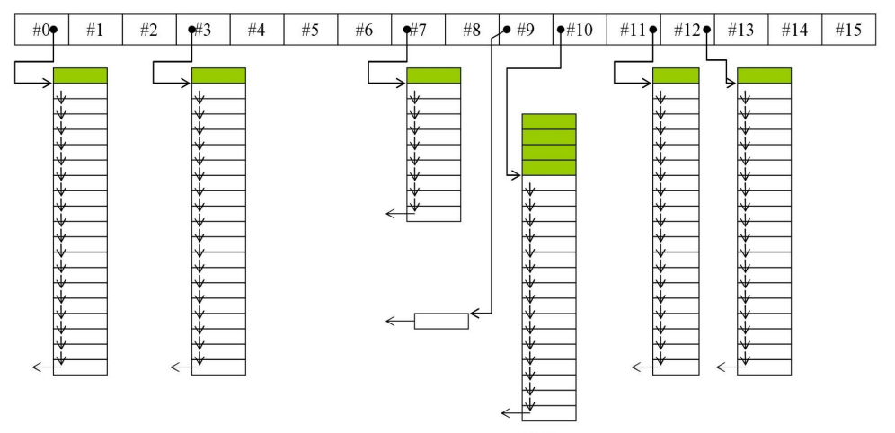

### 测试代码

[test11](./../src/test11.cpp)

## `new handler`

如果用户调用 `new` 申请一块内存，如果由于系统原因或者申请内存过大导致申请失败，这时将抛出 `std::bad_exception` 异常，在一些老的编译器中可能会直接返回 `0`。可以令编译器这么做:

```cpp
new (nothrow) Foo;
```

此称为 `nothrow` 形式。

拋出 `exception` 之前会先（不只一次）调用一个可由 `client` 指定的 `handler`。以下是 `new handler` 的形式和设定方法:

```cpp
typedef void(*new_handler)();
new_handler set_new_handler(new_handler p) throw ();
```

`set_new_handler` 返回之前设置的 `new_handler`。

设计良好的 `new handler` 只有两个选择:
- 让更多 `memory` 可用
- 调用 `abort()` 或 `exit()`

`C++` 设计是为了给我们一个机会，因为一旦内存不足，整个软件也不能运作，所以它借这个机会通知我们，也就是通过 `set_new_handler` 调用我们的函数，由我们来决定怎么办。

```cpp
operator new (std::size_t sz) _GLIBCXX_THROW (std::bad_alloc)
{
 void *p;
 
 
 /* malloc (0) is unpredictable; avoid it. */
 if (__builtin_expect (sz == 0, false))
   sz = 1;
 
 
 while ((p = malloc (sz)) == 0)
{
     new_handler handler = std::get_new_handler ();
     if (! handler)
     _GLIBCXX_THROW_OR_ABORT(bad_alloc());
     handler ();
}
 
 
 return p;
}
```

### 测试代码

[test11](./../src/test11.cpp)

## `=default`、`=delete`

有默认版本的函数才可以被设置为 `default`，`C++` 中有默认版本的函数
- 拷贝构造函数
- 拷贝赋值函数
- 析构函数

`operator new` 和 `operator delte` 都不能设置为 `default`，但可以设置为 `delete`。

### 测试代码

[test12](./../src/test12.cpp)