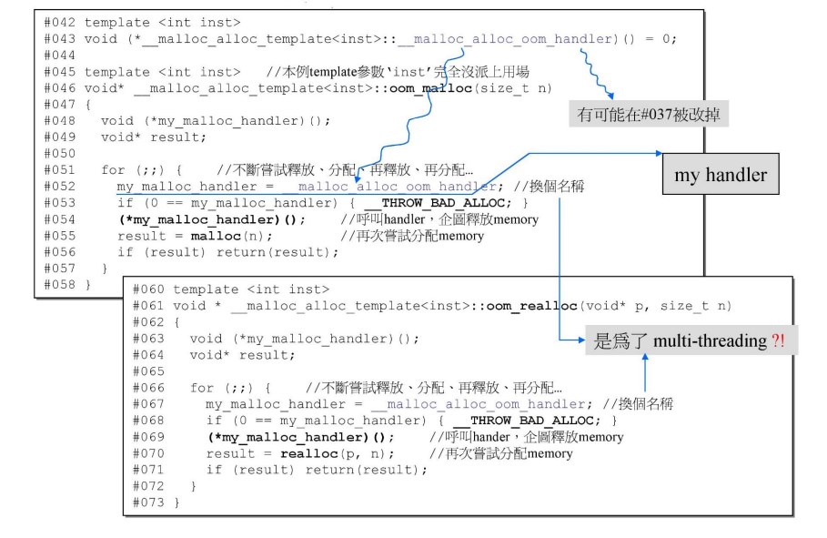

# `std::allocator`

> 西北有高楼，上与浮云齐

## `VC6 malloc()`


- `cookie` 主要记录当前分配的内存块的大小
- `VC6` 下 `cookie` 占用的大小是 `8` 个字节
- 假设对象很小，但是对象很多，那么就会有大量的 `cookie`，消耗了大量的内存
- 内存管理的目标: 提高效率，精简空间
- 是否有办法将 `cookie` 去除呢？

## 不同编译器的标准分配器的实现

### `VC6` 标准分配器之实现


- 调用流程: `allocate->_Allocate->operator new->malloc`
- `VC6` 编译器里面的 `allocator` 并没有做任何内存管理，只是将 `malloc` 以 `allocate` 的样子呈现出来
- `VC6` 的 `allocator` 只是以 `::operator new` 和 `::operator delete` 完成 `allocate()` 和 `deallocate()`，没有任何特殊设计
- VC 下的容器的第二个模板参数都是 `allocator`，所以 `VC6` 下使用容器，则最终内存分配都是靠 `malloc` 获得的，而 `malloc` 所分配的内存块中带着 `cookie`
- 此处的分配是以指定的元素的类型为单位

### `BC5` 标准分配器之实现


- 调用流程: `allocate->::operator new->malloc`
- `BC5` 的 `allocator` 只是以 `::operator new` 和 `::operator delete` 完成 `allocate()` 和 `deallocate()`，没有任何特殊设计
- 容器里使用的分配器就是 `allocator`，即获取到的内存块也是通过 `malloc` 分配的，该内存块是带着 `cookie` 的

我们的目标是要去除 `cookie`，而去除 `cookie` 有个先决条件，内存块的大小一样。

### `G2.9` 标准分配器之实现

#### `std::allocator` 的实现


- 调用流程: `allocate->::allocate->::operator new->malloc`
- `G2.9` 的 `allocator` 只是以 `::operator new` 和 `::operator delete` 完成 `allocate()` 和 `deallocate()`，没有任何特殊设计
- `STL` 中使用的不是这个分配器，这个文件并没有被包含到任何的 `STL` 头文件中

#### `G2.9` 容器使用的分配器，不是 `std::allocator` 而是 `std::alloc`


- `G2.9` 容器使用的分配器是 `std::alloc`
`alloc` 是个类，`alloc::allocate` 说明 `allocate` 是 `alloc` 这个类的静态函数
- 分配单位是字节

#### `(G2.9) std::alloc` vs. `(G4.9)__pool_alloc`


- 使用方法:
  - `G2.9` 版本的 `std::alloc`，写法:
    ```cpp
    vector<string, std::alloc<string>> vec;
    ```
  - `G4.9` 版本的 `__pool_alloc`，写法:
    ```cpp
    vector<string, __gnu_cxx::__pool_alloc<string>> vec;
    ```
- `G4.9` 标准库中有很多扩充的 `allocator`

### `G4.9` 标准分配器之实现

#### `std::allocator` 的实现


- 标准分配器说的就是 `std::allocator`
- 调用流程: `allocate->::operator new->malloc`
- `G4.9` 的 `allocator` 只是以 `::operator new` 和 `::operator delete` 完成 `allocate()` 和 `deallocate()`，没有任何特殊设计

#### `pool allocator` 使用示例


- 使用 `__pool_alloc` 去除了 `cookie`，如果 `100` 万个元素，去除 `cookie`，就省掉了 `800 万` 个字节，这个数据量很大了
- 可以看到使用 `std::allocator` 的时候，每个元素之间相差 `10h`，即 `16` 个字节，元素本身的大小为 `8` 字节，因为头尾带了 `cookie`，所以元素之间相距 `16` 字节，符合我们看到的内存块
- 某一次使用 `__gun_cxx::__pool_alloc` 的结果，指针之间相差不是 `08h`，并不能推翻分配的内存块不带 `cookie` 这个结论，因为是进行了 `3` 次分配，可能分配的内存块并不连续

各种编译器的标准分配器底层都是使用的 `malloc` 进行内存分配，分配的内存块是带着 `cookie` 的，`G2.9` 和 `G4.9` 存在着比标准分配器更优秀的 `extended allocator`。

## `G2.9 std::alloc` 运行模式

`G4.9` 版本和 `G2.9` 版本是一样的，只是 `G4.9` 的写法更为复杂一些，所以为了方便，看 `G2.9` 版本足以。


- `G2.9` 的容器使用的分配器是 `std::alloc`
- 分配器一定要提供两个重要的函数:
  - `allocate` （分配）
  - `deallocate` （回收）
- `16` 条链表，超过这个链表最大管理的内存块大小范围（ ）的内存分配不再受 `std::alloc` 管理，而是通过 `malloc` 进行分配；
- `#0` 串联 `8` 字节的内存块，`#1` 串联 `16` 字节的内存块，`#2` 串联 `24` 字节的内存块，以此类推，链表间的内存块相差 `8` 字节
- 如果容器中的每个元素需求的内存块的大小不是 `8` 的倍数，比如需要 `6`，则进入 `std::alloc` 这个系统后，会被调成 `8`，这个设计在所有的分配器上都一样，`malloc` 也是这样的设计
- 如果使用容器 `1`，每个元素的大小都是 `32` 字节，`#3` 是管理 `32` 字节的内存块的，一开始 `#3` 是空的，它就会去挖一块 `20 * 32` 大小的内存以备使用（`20` 应该是开发 `std::alloc` 的人员的经验值）。当这 `20` 块 `32` 字节的内存使用完之后，又会再要 `20 * 32` 字节大小的内存，以此类推
- 实际上挖的大小是 `20 * 2 * 32` 字节，而一半拿来切 `32` 字节的内存块，另一半空置等待使用。若此时使用另一个容器 `2`，每个元素的大小是 `64` 字节，则需要 `#7` 链表来管理 `64` 字节的内存块，当 `#7` 链表需要的时候，将剩余的 `20 * 32` 切割成每个内存块 `64` 字节的大小，可以切出 `10` 个，可以看到它们 `#3` 和 `#7` 的内存块是相连的，至此，分配的内存都使用完了
- 如果此时再使用一个容器 `3`，每个元素大小为 `96`，容器向分配器要 `96` 个字节，这个大小的内存块由 `#11` 管理，当前 `#11` 是空的，且没有可以切割的内存，于是向系统要 `20 * 2 * 96` 字节的内存，同样地，一半用于切割成 `20` 个 `96` 字节的内存块，一半空闲以备使用，即图中的 `start_free ~ end_free` 这一段内存
- 容器不再需要元素的时候，要归还内存，根据内存大小就回收到负责该大小的内存块的链表上
- 如果容器中的每个元素的大小为 `256 bytes`，超出了链表的内存块的范围，则这些内存的分配就不再归 `std::alloc` 管理，而是调用 `malloc` 进行分配，将分配得到的空间传回给容器
- 容器每次通过动态分配得到指针，容器本身是不知道分配得到的内存是否带 `cookie`
- `std::alloc` 里管理的内存块都是没有 `cookie` 的，当然链表为空时，向系统申请的 `20 * 2 * x` 字节是通过 `malloc` 申请的，

## `embedded pointers`


- 链表借用每个内存块的前 `4` 个字节，作为一个指针
- 当将内存块给到客户时，前面的 `4` 个字节是会被容器中的数据填充的；当内存块被归还的时候，又会将前 `4` 个字节作为一个指针
- 所有的有商业价值的、设计好的内存管理一定是使用了 `embedded pointer`
- 借用 `4` 个字节作为 `embedded pointer` 在源代码中的设计:
  ```cpp
  union obj { // 也可以该用 struct，就是链表的节点
    union obj* free_list_link;
    char client_data[1]; // 没有使用到
  };
  ```
- 对象本身大于等于 `4 bytes` 才能被借用，如果内存块的 `size` 小于 `4 bytes`，则不能借用了，虽然工业级存在海量的小区块，但是这些小区块多半都是大于 `4 bytes` 的，所以多半可以借用
- `64` 位系统指针是 `8 bytes`

### `G2.9 std::alloc` 运行一瞥


- 定义了 `16` 个指针，一开始全部为空


- 此处的申请 `32 bytes`，是应用端使用了容器，容器向分配器申请了 `32 bytes`
- 分配器的客户是容器，而不是程序员写的程序，如果程序员向直接使用分配器，必须记住申请的内存的大小，归还的时候将大小进行告知。而容器中的元素大小是相同的，容器的第一个模板参数是类型，`sizeof(类型)` 就可以知道元素的大小
- `RoundUp` 是个函数，将数字调到 `16` 的倍数，该值是个追加量: `RoundUp(0>>4)` 中的 `0>>4` 就是 `0` 除以 `16`
- 图中的这一整块是用 `malloc` 分配的，所以头尾都有 `cookie`
- `pool` 就是依靠 `start_free` 和 `end_free` 这两个指针围起来的


- 此时容器申请 `64 bytes`，使用上页中的 `pool` 进行切割


- 在代码中又创建了一个容器，申请 `88` 字节，`#10` 号链表管理的内存块大小，此时 `#10` 为空，但是 `pool` 中还有余量，于是从 `pool` 中进行划分


- 不在应用端再创建容器，而是某个容器连续三次申请 `88`，直接从 `#10` 链表里取出


- 在客户端又建立一个容器，申请 `8`，`#0` 为空，但是 `pool` 中还余 `240`，由于最多切 `20` 个，所以 `pool` 中还剩 `240 − 20 × 8 = 80`。


- 如果不同的容器申请的内存块大小相同，那么它们就会共用同一个链表
- 此时再创建一个新的容器，申请 `104`，由 `#12` 链表管理，此时 `#12` 为空，且 `pool` 中只有 `80`，不够
- 先处理这 `80 bytes` 的余量，`80 bytes` 应该归 `list #9` 管理，所以将 `pool` 中的 `80` 拨给 `list #9`
- 然后再通过 `malloc` 分配 `104×20×2+RoundUp(5200>>4)` 的内存大小，划分出 `20` 个 `104`，将最开头的那个给容器


- `pool` 中的数量不足以取 `20` 个，但至少能取 `1` 个时，尽可能多的取。


- 此处修改了系统源码将系统内存大小设置为了 `10000`
- 因为系统内存边界是 `10000`，此次申请的内存大小为 `72×20×2+RoundUp(9688>>4)`，无法满足，于是找到距离 `72 bytes` 最近的 `80 bytes`，即 `list #9` 管理的内存块，可以发现 `list #9` 中有一个 `80 bytes` 的内存块，于是将其回填到 `pool` 中，`list #9` 变为空，再从 `80 bytes` 这个内存块中切出 `72` 给客户，剩余 `8`


- 同上，已经达到系统边界，且 `list #8` 和 `pool` 不足，将 `pool` 挂进 `list`，`list #9` 也为空了，从 `list 10` 取。


申请 `120`，索取 `120∗20∗2+RoundUp(9688>>4)` 失败，且后面的 `list` 区块都是空的，此次操作失败，申请不到 `120 bytes` 的区块给客户；


- 但是这种情况下任存在空余的内存碎片，但是却无法利用

### `G2.9 std::alloc` 源码剖析


- 之前讲的核心的都在第二级分配器中，如果第二级分配器分配失败就会到第一级分配器中再试一次
- 第一级分配器模拟 `new handler`，通过一个循环不断地给你机会去分配
- `G4.9` 中已经没有这个第一级分配了




- 第一级分配器代码完毕


- 该分配器为 `_default_alloc_template`，一开始默认使用的分配器
- `ROUND_UP` 为上调函数，调整为 `8` 的倍数
- 嵌入式指针: 该联合体可以使用 `struct` 代替
  ```cpp
  union obj {
      union obj* free_list_link;
  };
  ```
- 所有的数据和函数都是静态的
- `FREELIST_INDEX` 函数计算出申请的内存块应该由第几号链表提供
- `free_list` 是一个有 `16` 个 `obj*` 元素的数组，`GCC 2.9` 的分配器用一个 `16` 字节数组管理 `16` 条链表，`free_list` 便是该管理数组
- `start_free` 和 `end_free` 分别指向该内存池的头和尾。中间管理的就是战备池


- `my_free_list` 变量为指针的指针
- 当申请的内存的大小大于 `128 bytes` 的时候，就改用第一级分配器
- 其中 `my_free_list = free_list + FREELIST_INDEX(n);` 表示定位到是第几号链表
- `*my_free_list = result->free_list_link;` 表示将第一块内存块给到客户，并向下移动指针
- 如果 `result == 0`，即链表为空，调用 `fill()` 函数分配内存
- `deallocate` 没有将内存还给操作系统，而是将申请到的内存全部掌握在自己手中，这不是内存泄漏，但是这种做法是有争议的


- 演示了内存分配的过程


- 演示了内存回收的过程


- `chunk_alloc` 函数

`result` 指向分配给用户的内存，`total_bytes` 为需要分配的内存块的大小，`bytes_left` 则是当前内存池中剩余的空间大小。

判断如果内存池剩余的内存大小多余需要分配的内存块大小，那么将内存池的首地址 `start_free` 直接赋值给 `result`，然后将 `start_free` 指针下移 `total_bytes` 距离，将当下的 `result~start_free` 之间的空间返回给用户。

如果 `bytes_left` 比 `total_bytes` 小，但是却比 `size` 大，这意味着不能直接分配 `size * nobjs` 大小内存给用户，那么可以先看看内存池当下的空间能分配多少个 `size` 大小的块给用户，然后将该块分配给用户，`start_free` 指针移动 `total_bytes` 长度。

否则，先内存池里面还有没有多余的内存，如果有，就充分处理碎片。然后就是不断地获取内存块，将这些内存块不断切割用链表连接起来，递归。


- `refill` 函数

战备池中剩余量计算函数，不断为战备池充值。


- 一些声明与初始化

### 测试代码

[test13](./../src/test13.cpp)

## `G2.9 std::alloc` 观念大整理


```cpp
c.push_back(Foo(1)); // 执行完这行，临时对象就消失了
```

- 此处的 `Foo(1)` 是个临时对象，非动态分配的，存在于 `stack`，容器 `c` 的内存是通过 `std::alloc` 分配的，所以不带 `cookie`。

```cpp
Foo* p = new Foo(2); 
c.push_back(*p);
```

- 此处的对象是在 `heap` 上建立的，`new` 底层就是通过 `malloc` 进行内存分配的，所以分配的内存块是带 `cookie` 的（客户端不知道是否带 `cookie`）
- `c.push_back(*p);` 容器向分配器发出请求，申请内存，分配器给容器分配它所需要的内存块大小用于存储分配的 `Foo` 对象，这个内存块是不带 `cookie` 的

## `std::alloc` 批斗大会


```cpp
obj* volatile *my_free_list, *p; // 定义的是 obj** my_free_list 和 obj* p 这两个变量
```

```cpp
if (0 == start_free) // 推荐这种写法，因为如果不小心写成 = 号，编译器会出错，而如果写成 start_free = 0，则是会编译通过的，这种 Bug 找起来就很困难了
```

- 变量尽量在使用的附近定义，否则中间做了很多其他操作，在使用的时候是不知道的
- 当要申请一大块内存而系统内存不够时，不进行减半的尝试，因为在多进程的机器上可能会导致大灾难，这个大灾难是针对的其它的进程
- `deallocate()` 没有调用 `free()` 或 `delete`，源于其设计上的先天缺陷: 交给客户的内存块没有指针一直记录着其地址，所以归还的时候不知道地址，就无法回收